# ms4-Bookish Nook
Developer - Alexandra Holstensson

[Link to the project - Heroku](https://bookish-nook-157d2cfc4403.herokuapp.com/)

## [Table of Contents](#table-of-contents)
1. [**About**](#1-about)
2. [**User Goals**](#2-user-goals)
    - [**External User Goals**](#external-user-goals)
    - [**Site Owner Goals**](#site-owner-goals)
3. [**User Stories**](#3-user-stories)
    - [**User Stories - Site Visitors**](#user-stories---site-visitors)
    - [**User Stories - Administrator(s)**](#user-stories---administrators)
4. [**Database Models Overview And Entity Relationship Diagram (ERD)**](#4-database-models-overview-and-entity-relationship-diagram-erd)
    - [**Database Models Overview**](#database-models-overview)
    - [**Entity Relationship Diagram (ERD)**](#entity-relationship-diagram-erd)
5. [**Agile Methodology**](#5-agile-methodology)
    - [**User Story Prioritization - MoSCoW Method**](#user-story-prioritization---moscow-method)
    - [**Kanban Workflow**](#kanban-workflow)
6. [**Design Of The Website**](#6-design-of-the-website)
    - [**Structure**](#structure)
    - [**Wireframes**](#wireframes)
        - [**Mobile Wireframes**](#mobile-wireframes)
        - [**Tablet Wireframes**](#tablet-wireframes)
        - [**Laptop/Desktop Wireframes**](#laptopdesktop-wireframes)
    - [**Colors**](#colors)
    - [**Fonts**](#fonts)
    - [**Icons And Images**](#icons-and-images)
7. [**Existing Features**](#7-existing-features)
    - [**Existing Features - Site Visitors**](#existing-features---site-visitors)
        - [**Navigation And Footer**](#navigation-and-footer)
        - [**Home Page**](#home-page)
        - [**Create Account**](#create-account)
        - [**Login**](#login)
        - [**Logout**](#logout)
        - [**View/Show Products**](#viewshow-products)
        - [**Buy Product**](#buy-product)
        - [**View And Edit User Details**](#view-and-edit-user-details)
        - [**View Orders and Order Details**](#view-orders-and-order-details)
    - [**Existing Features - Administrator(s)**](#existing-features---administrators)
        - [**View/Show Products**](#viewshow-products-1)
        - [**Add Product**](#add-product)
        - [**Edit Product details**](#edit-product-details)
        - [**Delete Product**](#delete-product)
        - [**View/Show Orders**](#viewshow-orders)
        - [**Update Order Details**](#update-order-details)
8. [**Features Left To Implement**](#8-features-left-to-implement)
    - [**Features Left To Implement - Site Visitors**](#features-left-to-implement---site-visitors)
    - [**Features Left To Implement - Administrator(s)**](#features-left-to-implement---administrators)
9. [**Technologies Used**](#9-technologies-used)
    - [**Languages**](#languages)
    - [**Programs And Other Resources**](#programs-and-other-resources)
10. [**Testing**](#10-testing)
    - [**User Story Testing**](#user-story-testing)
    - [**Manual Testing - Site Visitors**](#manual-testing---site-visitors)
        - [**Test - Navigation And Footer**](#test---navigation-and-footer)
        - [**Test - Home Page**](#test---home-page)
        - [**Test - Create Account**](#test---create-account)
        - [**Test - Login**](#test---login)
        - [**Test - Logout**](#test---logout)
        - [**Test - View/Show Products**](#test---viewshow-products)
        - [**Test - Buy Product**](#test---buy-product)
        - [**Test - View And Edit User Details**](#test---view-and-edit-user-details)
        - [**Test - View Orders and Order Details**](#test---view-orders-and-order-details)
    - [**Manual Testing - Administrator(s)**](#manual-testing---administrators)
        - [**Test - View/Show Products**](#test---viewshow-products-1)
        - [**Test - Add Product**](#test---add-product)
        - [**Test - Edit Product details**](#test---edit-product-details)
        - [**Test - Delete Product**](#test---delete-product)
        - [**Test - View/Show Orders**](#test---viewshow-orders)
        - [**Test - Update Order Status**](#test---update-order-details)
    - [**Automated Testing**](#automated-testing)
11. [**Bugs And Problems**](#11-bugs-and-problems)
12. [**Validation**](#12-validation)
    - [**HTML**](#html)
    - [**CSS**](#css)
    - [**JavaScript**](#javascript)
    - [**Python**](#python)
13. [**Lighthouse Testing**](#13-lighthouse-testing)
    - [**Desktop**](#desktop)
    - [**Mobile**](#mobile)
14. [**Device Testing**](#14-device-testing)
15. [**Browser Compatibility**](#15-browser-compatibility)
16. [**Deployment**](#16-deployment)
    - [**Local Deployment**](#local-deployment)
    - [**Remote Deployment**](#remote-deployment)
17. [**Credits**](#17-credits)

## 1. About
[Back To The Top](#table-of-contents)

Bookish Nook is made as part (Milestone Project 4) of the Level 5 Diploma in Web Application Development course at Code Institute.

Bookish Nook is a webshop that sells book accessories such as bookmarks, book sleeves, reading lights, bookends, stickers & sticky tabs, and smaller notebooks & pens.

## 2. User Goals
[Back To The Top](#table-of-contents)
### External User Goals

Visitors/users can view and, if they want to, purchase book accessories.

* Find and filter book accessories quickly (categories, search, sorting).
* See product details (price, picture, description) and available variations.
* Add products to cart, update quantity, delete.
* Smooth checkout with secure payment (Stripe) and email receipt.
* Create an account / log in to save address information and see order history.
* Subscribe to newsletter (with double opt-in).
* Contact the store via the contact form.

### Site Owner Goals
Create a demand for book accessories and make money selling these products.

* Add/edit/delete products and categories easily (Backoffice).
* View and manage incoming orders (status flow).
* See dashboard for quick mode (latest orders, totals).
* Switch the email list (Newsletter).
* Run stable operations with S3 (media), Postgres and Heroku.

## 3. User Stories
[Back To The Top](#table-of-contents)
### User Stories - Site Visitors
#### **Epic 1: User Account Management**
* **User Account Registration**
    * As a new user, I can register for an account so that I can access personal features.
* **Securely Log In With User Account**
    * As a registered user, I can log in and out so that I can access my account securely.
* **Change Password If Password Is Forgotten**
    * As a user I can reset my password so that I can access my account again.
* **Update User Details**
    * As a user, I can update my profile information so that my details are up to date.
* **View Order History**
    * As a user, I can view my order history so that I can track my purchases.

#### **Epic 2: Product Browsing and Search**
* **Display All Products**
    * As a customer, I can see all products so that I can browse the available items.
* **Search For Products**
    * As a customer, I can search for products so that I can find specific items.
* **Filter Products**
    * As a customer, I can filter products by category so that I can narrow down my options.
* **Sort Products According To Price Or Name**
    * As a customer, I can sort products by price or name so that I can organize the displayed items.
* **See Detailed Product Information**
    * As a customer, I can see detailed information about products so that I can make informed purchases.

#### **Epic 3: Shopping Cart and Checkout**
* **Adding Items To Cart**
    * As a customer, I can add products to my shopping cart so that I can purchase multiple items.
* **Change The Quantity Of An Item**
    * As a customer, I can change how many of a specific item I want to purchase so that I can change my order before placing it.
* **Securely Go Through Checkout**
    * As a customer, I can safely go to the checkout so that I can complete my purchase.
* **Receive An Order Confirmation Sent Via Email**
    * As a customer, I can receive an order confirmation so that I know that my purchase has gone through.

#### **Epic 4: Product Reviews**
* **Leave Product Reviews**
    * As a registered user on the website, I can leave reviews about products so that I can share my experiences.
* **Rate Products**
    * As a registered user, I can rate products so that I can give my opinion about them.
* **Read Other Customers' Reviews**
    * As a customer, I can read other customers' reviews and ratings of products so that I can make informed decisions.

### User Stories - Administrator(s)
#### **Epic 5: Site Administration**
* **Add New Products**
    * As the administrator of the webshop, I can add new products so that I can expand the assortment.
* **Update Product Details**
    * As the administrator of the webshop, I can edit product information so that I can keep it up to date.
* **Delete Products**
    * As the administrator of the webshop, I can delete products so that I can remove products from the webshop that are no longer sold.
* **Manage Order Status**
    * As the owner of the webshop, I can manage placed orders so that I can process customers' purchases

## 4. Database Models Overview And Entity Relationship Diagram (ERD)
[Back To The Top](#table-of-contents)
### Database Models Overview
Description of the models that I use in my project.

- **App:** home
    - **Model name:**
        - NewsletterSubscriber
- **App:** orders
    - **Model names:**
        - Order
        - OrderItem
        - ProcessedStripeEvent
- **App:** products
    - **Model names:**
        - Category
        - Product
- **App:** profiles
    - **Model names:**
        - Profile
        - Address

- **home**
    - **NewsletterSubscriber**
        - **Purpose:** Manages newsletter subscribers including double opt-in and unsubscribe.
        - **Fields:**
            - email (EmailField, unique): Subscriber's email address
            - created_at (DateTime): When the record was created.
            - confirmed (Boolean): If the email address has been confirmed.
            - confirm_token (CharField, idx): Token for confirmation link.
            - confirm_sent_at / confirmed_at (DateTime): Dispatch and confirmation time.
            - unsubscribed (Boolean): Deregistered.
            - unsubscribe_token (CharField, idx): Token for unsubscribe link.
        - **Relations:** -    
        - **Note:** _Supports double opt-in flow (submit/validate token)._

- **orders**
    - **Order**
        - **Purpose:** Represents a placed order and its totals/status.
        - **Fields:**
            - created / updated (DateTime): Timestamps.
            - email (EmailField, null=True): Customer's email (may reflect user's).
            - total (Decimal): Subtotal (possibly excluding tax/shipping).
            - shipping (Decimal): Shipping cost.
            - tax_amount (Decimal): VAT/tax.
            - grand_total (Decimal): Final amount.
            - status (CharField): "pending" | "paid" | "cancelled".
            - stripe_session_id (CharField, null=True): Reference to Stripe session.
            - Shipping fields: full_name, phone, address_line1/2, postal_code, city, country (ISO2).
            - Billing fields: billing_name, billing_line1/2, billing_postal, billing_city, billing_country.
        - **Relations:**
            - items (OrderItem*): Lines in the order.
        - **Note:** _The status is updated via checkout/webhook. Total reflects cart at time of purchase._
    - **OrderItem**
        - **Purpose:** A single line in an order (snapshot of product + price at purchase).
        - **Fields:**
            - order (FK Order, CASCADE): Related orders.
            - product (FK Product, PROTECT): Referenced product.
            - name (CharField): Product name (copied for history).
            - unit_price (Decimal): Price per piece (snapshot).
            - qty (PositiveInteger): Quantity.
            - subtotal (Decimal): The row total (qty × unit_price).
        - **Relations:** product → Product, order → Order.
    - **ProcessedStripeEvent**
        - **Purpose:** Prevent duplicate side effects from Stripe (idempotence protection).
        - **Fields:**
            - event_id (Char, unique): The Stripe event ID.
            - created_at (DateTime, auto_now_add): When the event was marked as processed.
        - **Relations:** - (detached from other models; used by the webhook)

- **products**
    - **Category**
        - **Purpose:** Hierarchical product categories (root + subcategories).
        - **Fields:**
            - name (CharField), slug (SlugField): Name/slug.
            - parent (FK Category, null=True): For tree/nesting.
            - is_active (Boolean): Shown/hidden
            - is_featured (Boolean): If it should be displayed on the home page.
            - featured_order (PositiveInteger): Sorting on the home page (lowest first).
            - description (TextField): Description.
            - image (ImageField, null=True): Category image (S3 in production).
        - **Relations:**
            - children (Reverse FK Category): Subcategories.
            - products (Reverse FK Product): Products in the category.
    - **Product**
        - **Purpose:** Salable product in the store.
        - **Fields:**
            - category (FK Category, PROTECT): Category.
            - name (CharField), slug (SlugField, unique): Name/unique slug (can be auto-slugged).
            - description (Text): Description.
            - price (Decimal): Price.
            - image (ImageField, null=True): Product image (S3 in production).
            - is_active (Boolean): Shown/hidden in lists.
            - stock (PositiveInteger): Stock.
            - created/updated (DateTime): Timestamps.
        - **Relations:**
            - category → Category, is used by OrderItem.

- **profiles**
    - **Profile**
        - **Purpose:** Extended user information (customer data/newsletter).
        - **Field:**
            - user (OneToOne User): Connection to auth-user.
            - full_name (CharField), phone (CharField): Contact.
            - newsletter_opt_in (Boolean): Consent for the newsletter.
        - **Relations:** 
            - user → User.
        - **Note:** _Often created/maintained via signal at User creation._
    - **Address**
        - **Purpose:** Saved addresses per user (e.g. shipping/billing).
        - **Fields:**
            - user (FK User, CASCADE): Owner.
            - kind (CharField): Address Type (e.g. "shipping"|"billing").
            - full_name, phone (CharField): Contact field.
            - line1/line2 (CharField): Address lines.
            - postal_code (CharField), city (CharField), country (CharField, ISO2): City/country.
            - is_default (Boolean): Default address for selected type.
        - **Relations:**
            - user → User. Multiple addresses per user.

- **User (Django auth.User)**
    - **Purpose:** Built-in user model for authentication/permissions.
    - **Fields (common and important):**
        - username (Char, unique, required): Inloggnings-ID (if you have not changed to custom user).
        - password (Char, required): Hashed password (Django PBKDF2/Argon2 etc.).
        - email (Email): User's email (can be unique if set).
        - first_name, last_name (Char): Name field (optional).
        - is_active (Bool, default=True): If the account is active.
        - is_staff (Bool): Access to Django admin.
        - is_superuser (Bool): Full permissions.
        - last_login (DateTime): Last login.
        - date_joined (DateTime, auto): When the account was created.
    - **Relations:**
        - 1–1 → Profile (your app).
        - 1–* → Address (one user can have multiple addresses (for example, different shipping and billing addresses)).

### Entity Relationship Diagram (ERD)

I used [drawDB](https://www.drawdb.app/) to create an Entity Relationship Diagram (ERD). The relationships between the tables are drawn. The About and ContactRequest tables are completely independent (they have no connection to any other table). A picture of the ERD is below.

## 5. Agile Methodology
[Back To The Top](#table-of-contents)
### User Story Prioritization - MoSCoW Method

Must have: Browse products, product details, shopping cart, checkout (Stripe), account (login/signup), order confirmation via email.
Should have: Profile & order history, filter/sorting, double opt-in newsletter, backoffice CRUD for products/orders.
Could have: Promotion section (“Bargain Corner”), product reviews, wish list.
Won’t have (nu): Full review system and ratings with moderation.

### Kanban Workflow

I have used a Kanban board to structure the work on the website. In the Kanban board, I have chosen to divide all tasks (issues) into three different stages:

ToDo - Features that I plan to add to the website.
Won’t Have This Iteration - Features that are not added in this version of the website, but may be added in a future version.
In Progress - Features that I am currently working on.
Done - Features that are complete and that work as they should.

Link to the project [Kanban Board](https://github.com/users/AlexandraH-code/projects/12/views/1) - add link to kanban board

## 6. Design Of The Website
[Back To The Top](#table-of-contents)
### Structure

The website's pages consist of three different parts: header, main (where the main content of a page is placed) and footer. The header and footer look the same on all pages.

I have chosen to structure my website with the following pages:
- **Home Page:**
    - Home page that contains a large hero image with a button that says "See All Products". Below the hero image you can see images/links to four of the website's product categories.
- **Sign in:**
    - Sign in contains a form with fields for email address and password and a Sign in button. The page also has links to Forgot password (if you have forgotten your password) and Create account (if you do not have an account yet). The page is displayed as a modal when you click Sign in in the menu.
- **Create account:**
    - Create account contains a form with fields for email address, password, password confirmation and a Sign up button. The page also contains a Sign in link (if you have already registered an account on the website). The page is displayed as a modal when you click Sign in in the menu.
- **My Account:**
    - On the My Account page you can change your user details, change your password, manage addresses and view any orders.
- **Logout:**
    - Logout contains a Log out button.
- **Backoffice:**
    - On the Backoffice page, you can see the number of orders and a list of recently placed orders. There are also buttons that go to pages where an administrator can view and manage orders and view and manage products. There is also a button that goes to Django Admin.
- **About Us:**
    - A page that contains information about the website.
- **Contact Us:** 
    - Contains a contact form that the visitor can fill out if they want to get in touch with the website owner.
- **FAQ:**
    - A page with frequently asked questions that have been asked to the website owner.

The pages above can be accessed by clicking on one of the links in the menu bar at the top of the page or in the footer at the bottom of the page.. On small screens (smaller than 992 pixels) the menu is collapsed in the upper left corner. 

### Wireframes

I used the program [Balsamiq](https://balsamiq.com/) to create wireframes for my website. The wireframes show how I planned the website to look and be constructed. The finished website may differ slightly from the wireframes.

I have divided the wireframes into three different sections: mobile, tablet and desktop.

#### Mobile Wireframes
  

  
Home Page - Not Logged In

  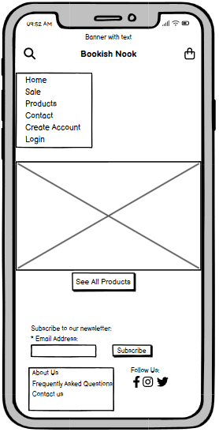
  
  

  
  

  
Home Page - Logged In

  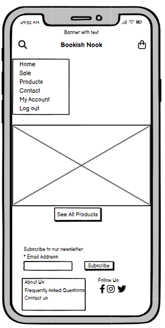
  
  

  
  

  
Sale

  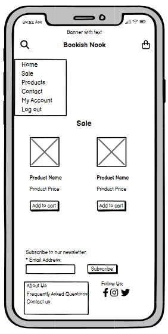
  
  

  
  

  
Products

  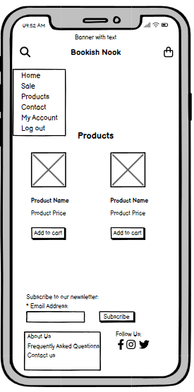
  
  

  
  

  
Product Details

  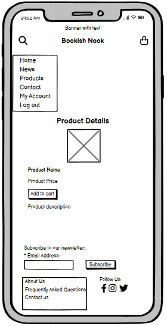
  
  

  
  

  
Contact

  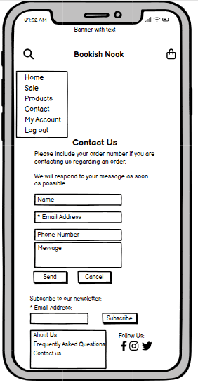
  
  

  
  

  
About Us

  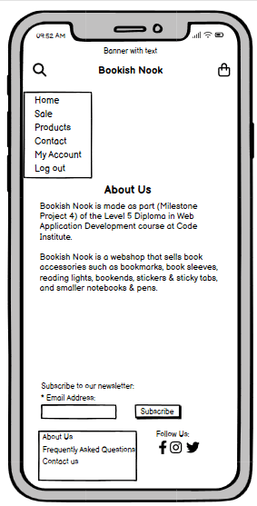
  
  

  
  

  
FAQ

  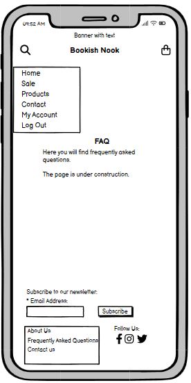
  
  

#### Tablet Wireframes
  

  
Home Page - Not Logged In

  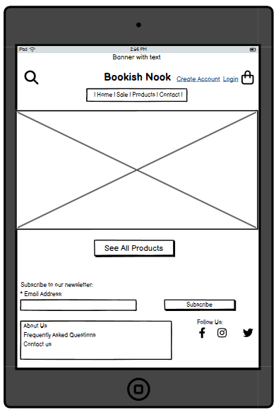
  
  

  
  

  
Home Page - Logged In

  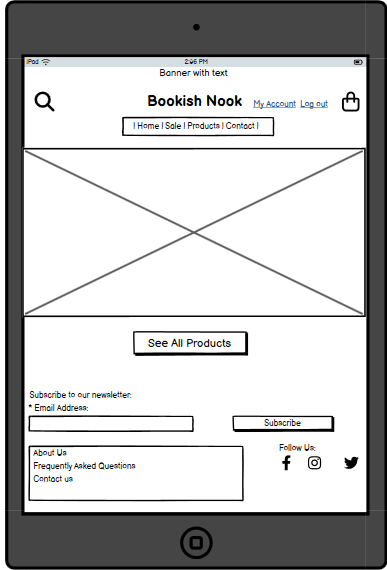
  
  

  
  

  
Sale

  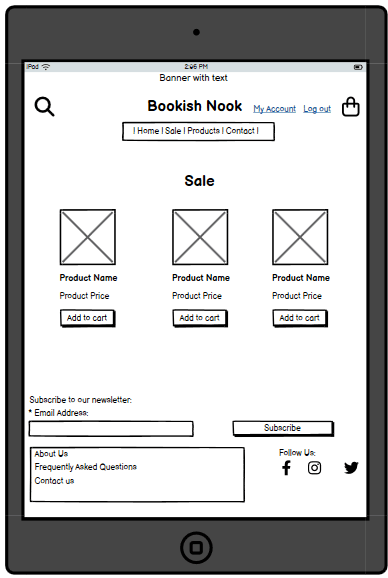
  
  

  
  

  
Products

  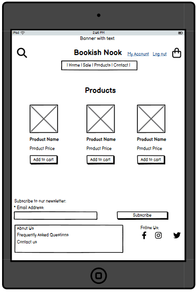
  
  

  
  

  
Product Details

  
  
  

  
  

  
Contact

  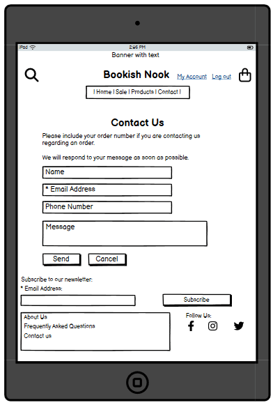
  
  

  
  

  
About Us

  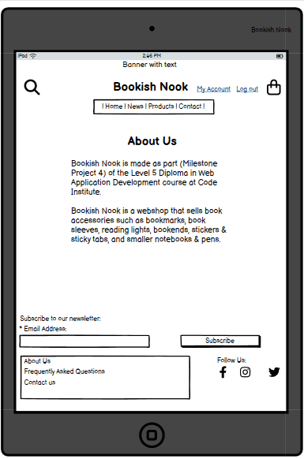
  
  

  
  

  
FAQ

  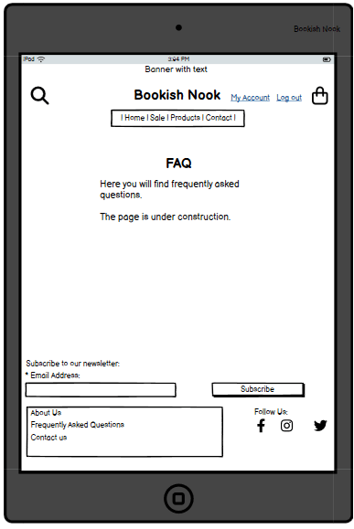
  
  

#### Laptop/Desktop Wireframes
  

  
Home Page - Not Logged In

  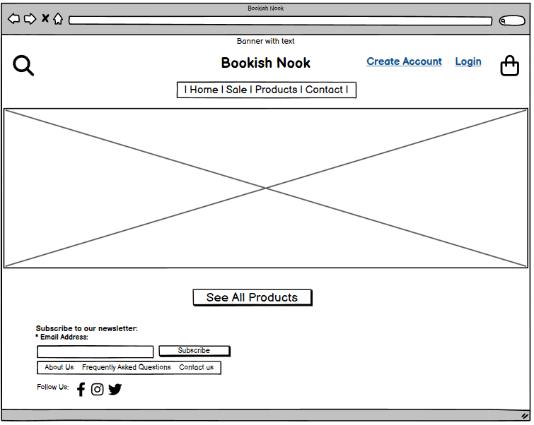
  
  

  
  

  
Home Page - Logged In

  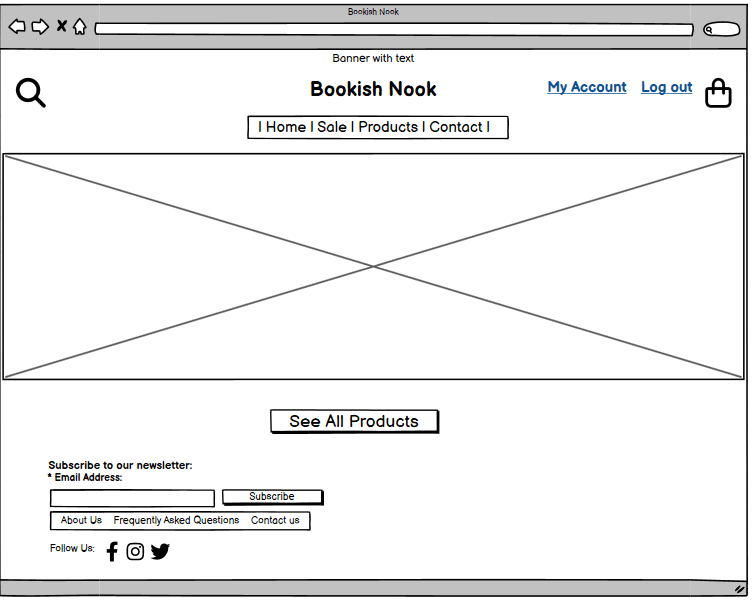
  
  

  
  

  
Sale

  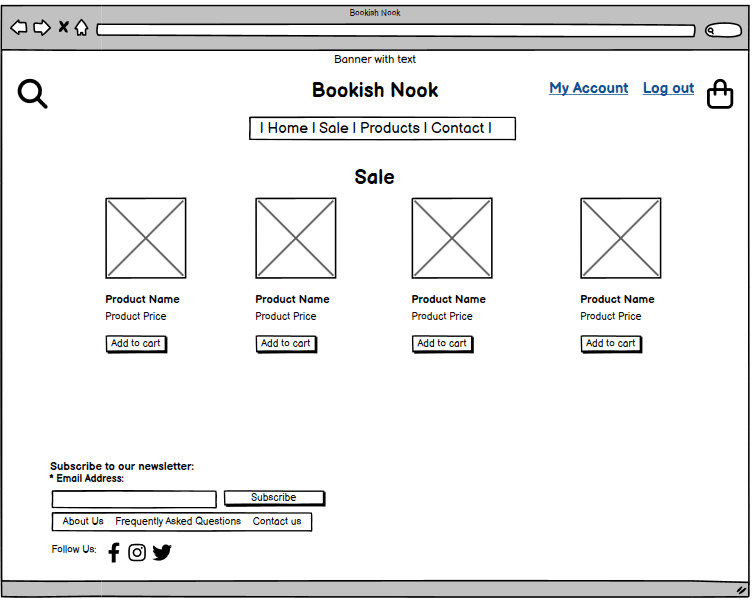
  
  

  
  

  
Products

  
  
  

  
  

  
Product Details

  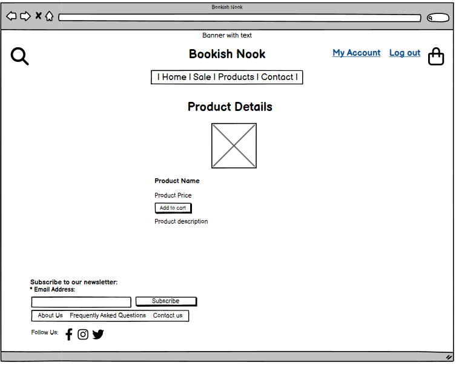
  
  

  
  

  
Contact

  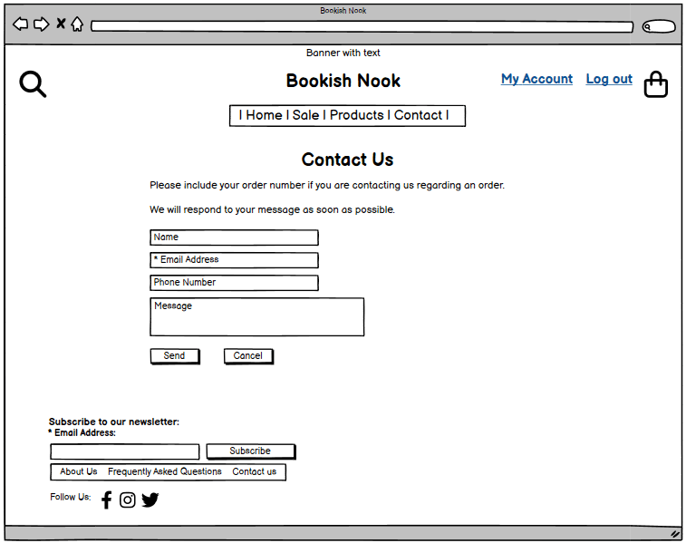
  
  

  
  

  
About Us

  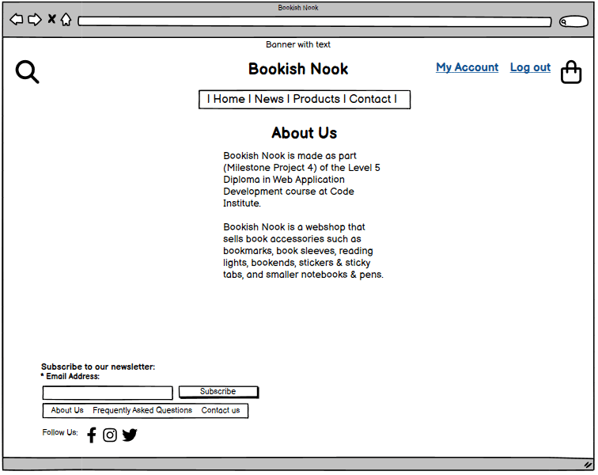
  
  

  
  

  
FAQ

  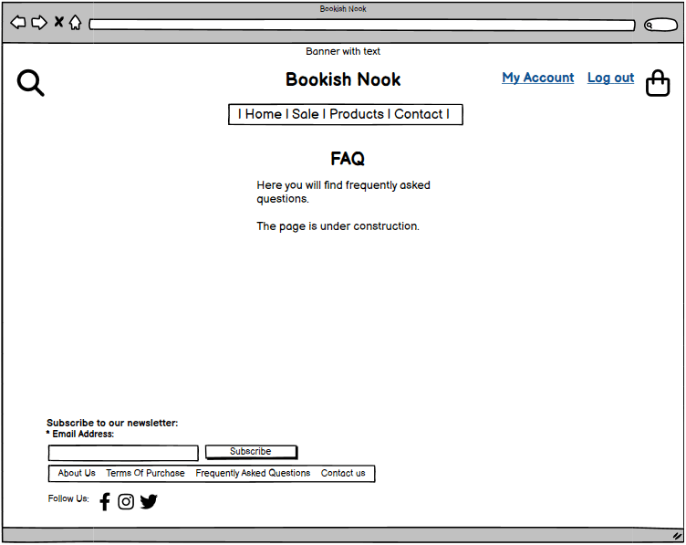
  
  

### Colors

The color palette was chosen to create a cozy, book-inspired atmosphere with warm earthy tones and soft accents.  

| Color | Hex | Example |
|-------|-----|---------|
| **Primary Brown** | `#5A3825` |  |
| **Cream** | `#FFF8F0` |  |
| **Sage** | `#A3B18A` |  |
| **Rose** | `#D8A7B1` |  |
| **Dark Dropdown Brown** | `#4A2F21` |  |
| **Text** | `#333333` |  |

> **Design rationale:**  
> The deep brown provides a strong, warm foundation, while cream ensures a light and comfortable background for reading. Sage green and rose pink were introduced as *accent colors* — sage conveys calmness and nature, while rose adds a soft, welcoming warmth. These subtle contrasts prevent the design from feeling flat and reinforce the cozy “book nook” aesthetic.

[ColorMagic's ContastChecker](https://colormagic.app/contrast-checker)

### Fonts

The project uses two complementary Google Fonts:  

- **Playfair Display (serif)** – used for titles, headings, and the brand logo.  
- **Lato (sans-serif)** – used for body text and general content.  

> **Design rationale:**  
> *Playfair Display* was chosen for its elegant and slightly decorative style, giving a classic “bookish” feeling that works well for headings and brand identity. Its contrast in stroke weight creates a timeless impression reminiscent of printed literature.  
>  
> *Lato* was selected as the primary body font because of its modern, clean, and highly readable design. This ensures that product descriptions, instructions, and longer text blocks remain easy to read on both desktop and mobile.  
>  
> Together, these fonts balance **warmth and elegance** with **clarity and readability**, reinforcing the bookstore-inspired aesthetic of *Bookish Nook*.  

### Icons And Images

## 7. Existing Features
[Back To The Top](#table-of-contents)
### Existing Features - Site Visitors
[Back To The Top](#table-of-contents)
#### Navigation And Footer
#### Home Page
#### Create Account
#### Login
#### Logout
#### View/Show Products
#### Buy Product
#### View And Edit User Details
#### View Orders and Order Details
### Existing Features - Administrator(s)
[Back To The Top](#table-of-contents)
#### View/Show Products
#### Add Product
#### Edit Product details
#### Delete Product
#### View/Show Orders
#### Update Order Status

## 8. Features Left To Implement
[Back To The Top](#table-of-contents)
In addition to the features that are currently added to the website, I have come up with some other features that could be added in the future. I have divided the features into Features Left To Implement - Site Visitors and Features Left To Implement - Administrator(s).
### Features Left To Implement - Site Visitors
### Features Left To Implement - Administrator(s)

## 9. Technologies Used
[Back To The Top](#table-of-contents)
### Languages
### Programs And Other Resources

## 10. Testing
[Back To The Top](#table-of-contents)
### User Story Testing
### Manual Testing - Site Visitors
#### Test - Navigation And Footer
#### Test - Home Page
#### Test - Create Account
#### Test - Login
#### Test - Logout
#### Test - View/Show Products
#### Test - Buy Product
#### Test - View And Edit User Details
#### Test - View Orders and Order Details
### Manual Testing - Administrator(s)
#### Test - View/Show Products
#### Test - Add Product
#### Test - Edit Product details
#### Test - Delete Product
#### Test - View/Show Orders
#### Test - Update Order Details
### Automated Testing

## 11. Bugs And Problems
[Back To The Top](#table-of-contents)

## 12. Validation
[Back To The Top](#table-of-contents)
### HTML
### CSS
### JavaScript
### Python

## 13. Lighthouse Testing
[Back To The Top](#table-of-contents)
### Desktop
### Mobile

## 14. Device Testing
[Back To The Top](#table-of-contents)

## 15. Browser Compatibility
[Back To The Top](#table-of-contents)

## 16. Deployment
[Back To The Top](#table-of-contents)
### Local Deployment
### Remote Deployment

## 17. Credits
[Back To The Top](#table-of-contents)
