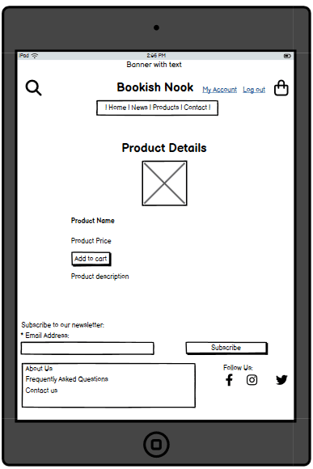

# ms4-bookishnook
# Bookish Nook
Developer - Alexandra Holstensson

[Link to the project - Heroku](https://bookish-nook-157d2cfc4403.herokuapp.com/)

## [Table of Contents](#table-of-contents)
1. [**About**](#1-about)
2. [**User Goals**](#2-user-goals)
    - [**External User Goals**](#external-user-goals)
    - [**Site Owner Goals**](#site-owner-goals)
3. [**User Stories**](#3-user-stories)
    - [**User Stories - Site Visitors**](#user-stories---site-visitors)
    - [**User Stories - Administrator(s)**](#user-stories---administrators)
4. [**Database Models Overview And Entity Relationship Diagram (ERD)**](#4-database-models-overview-and-entity-relationship-diagram-erd)
    - [**Database Models Overview**](#database-models-overview)
    - [**Entity Relationship Diagram (ERD)**](#entity-relationship-diagram-erd)
5. [**Agile Methodology**](#5-agile-methodology)
    - [**User Story Prioritization - MoSCoW Method**](#user-story-prioritization---moscow-method)
    - [**Kanban Workflow**](#kanban-workflow)
6. [**Design Of The Website**](#6-design-of-the-website)
    - [**Structure**](#structure)
    - [**Wireframes**](#wireframes)
        - [**Mobile Wireframes**](#mobile-wireframes)
        - [**Tablet Wireframes**](#tablet-wireframes)
        - [**Laptop/Desktop Wireframes**](#laptopdesktop-wireframes)
    - [**Colors**](#colors)
    - [**Fonts**](#fonts)
    - [**Icons And Images**](#icons-and-images)
7. [**Existing Features**](#7-existing-features)
    - [**Existing Features - Site Visitors**](#existing-features---site-visitors)
        - [**Navigation And Footer**](#navigation-and-footer)
        - [**Home Page**](#home-page)
        - [**Create Account**](#create-account)
        - [**Login**](#login)
        - [**Logout**](#logout)
        - [**View/Show Products**](#viewshow-products)
        - [**Buy Product**](#buy-product)
        - [**View And Edit User Details**](#view-and-edit-user-details)
        - [**View Orders and Order Details**](#view-orders-and-order-details)
    - [**Existing Features - Administrator(s)**](#existing-features---administrators)
        - [**View/Show Products**](#viewshow-products-1)
        - [**Add Product**](#add-product)
        - [**Edit Product details**](#edit-product-details)
        - [**Delete Product**](#delete-product)
        - [**View/Show Orders**](#viewshow-orders)
        - [**Update Order Details**](#update-order-details)
8. [**Features Left To Implement**](#8-features-left-to-implement)
    - [**Features Left To Implement - Site Visitors**](#features-left-to-implement---site-visitors)
    - [**Features Left To Implement - Administrator(s)**](#features-left-to-implement---administrators)
9. [**Technologies Used**](#9-technologies-used)
    - [**Languages**](#languages)
    - [**Programs And Other Resources**](#programs-and-other-resources)
10. [**Testing**](#10-testing)
    - [**User Story Testing**](#user-story-testing)
    - [**Manual Testing - Site Visitors**](#manual-testing---site-visitors)
        - [**Test - Navigation And Footer**](#test---navigation-and-footer)
        - [**Test - Home Page**](#test---home-page)
        - [**Test - Create Account**](#test---create-account)
        - [**Test - Login**](#test---login)
        - [**Test - Logout**](#test---logout)
        - [**Test - View/Show Products**](#test---viewshow-products)
        - [**Test - Buy Product**](#test---buy-product)
        - [**Test - View And Edit User Details**](#test---view-and-edit-user-details)
        - [**Test - View Orders and Order Details**](#test---view-orders-and-order-details)
    - [**Manual Testing - Administrator(s)**](#manual-testing---administrators)
        - [**Test - View/Show Products**](#test---viewshow-products-1)
        - [**Test - Add Product**](#test---add-product)
        - [**Test - Edit Product details**](#test---edit-product-details)
        - [**Test - Delete Product**](#test---delete-product)
        - [**Test - View/Show Orders**](#test---viewshow-orders)
        - [**Test - Update Order Status**](#test---update-order-details)
    - [**Automated Testing**](#automated-testing)
11. [**Bugs And Problems**](#11-bugs-and-problems)
12. [**Validation**](#12-validation)
    - [**HTML**](#html)
    - [**CSS**](#css)
    - [**JavaScript**](#javascript)
    - [**Python**](#python)
13. [**Lighthouse Testing**](#13-lighthouse-testing)
    - [**Desktop**](#desktop)
    - [**Mobile**](#mobile)
14. [**Device Testing**](#14-device-testing)
15. [**Browser Compatibility**](#15-browser-compatibility)
16. [**Deployment**](#16-deployment)
    - [**Local Deployment**](#local-deployment)
    - [**Remote Deployment**](#remote-deployment)
17. [**Credits**](#17-credits)

## 1. About
[Back To The Top](#table-of-contents)

Bookish Nook is made as part (Milestone Project 4) of the Level 5 Diploma in Web Application Development course at Code Institute.

Bookish Nook is a webshop that sells book accessories such as bookmarks, book sleeves, reading lights, bookends, stickers & sticky tabs, and smaller notebooks & pens.

## 2. User Goals
[Back To The Top](#table-of-contents)
### External User Goals
### Site Owner Goals

## 3. User Stories
[Back To The Top](#table-of-contents)
### User Stories - Site Visitors
### User Stories - Administrator(s)

## 4. Database Models Overview And Entity Relationship Diagram (ERD)
[Back To The Top](#table-of-contents)
### Database Models Overview
Description of the models I use on the website.

- **User Model (Django built-in)** - (Right now I only use the username, email and password fields.)
  - Handles authentication and user information.
  - Fields (standard):
    - username (CharField): Unique username for login
    - email (EmailField): User’s email address
    - password (CharField): Hashed password
    - first_name, last_name (CharField): Optional names
    - is_staff, is_superuser, is_active (BooleanField): Admin and access control flags
    - date_joined (DateTimeField): When the user registered
  - Relationships:
    - One-to-many with BlogPost (a user can create many books if extended)
    - One-to-many with Comment (user can write multiple comments)
    - One-to-many with StarRating (user can submit multiple ratings)

### Entity Relationship Diagram (ERD)

I used [drawDB](https://www.drawdb.app/) to create an Entity Relationship Diagram (ERD). The relationships between the tables are drawn. The About and ContactRequest tables are completely independent (they have no connection to any other table). A picture of the ERD is below.

## 5. Agile Methodology
[Back To The Top](#table-of-contents)
### User Story Prioritization - MoSCoW Method
### Kanban Workflow

I have used a Kanban board to structure the work on the website. In the Kanban board, I have chosen to divide all tasks (issues) into three different stages:

ToDo - Features that I plan to add to the website.
Won’t Have This Iteration - Features that are not added in this version of the website, but may be added in a future version.
In Progress - Features that I am currently working on.
Done - Features that are complete and that work as they should.

Link to the project [Kanban Board](https://github.com/users/AlexandraH-code/projects/12/views/1) - add link to kanban board

## 6. Design Of The Website
[Back To The Top](#table-of-contents)
### Structure

The website's pages consist of three different parts: header, main (where the main content of a page is placed) and footer. The header and footer look the same on all pages.

I have chosen to structure my website with the following pages:
- **Home Page:**
    - Home page that contains a large hero image with a button that says "See All Products". Below the hero image you can see images/links to four of the website's product categories.
- **Sign in:**
    - Sign in contains a form with fields for email address and password and a Sign in button. The page also has links to Forgot password (if you have forgotten your password) and Create account (if you do not have an account yet). The page is displayed as a modal when you click Sign in in the menu.
- **Create account:**
    - Create account contains a form with fields for email address, password, password confirmation and a Sign up button. The page also contains a Sign in link (if you have already registered an account on the website). The page is displayed as a modal when you click Sign in in the menu.
- **My Account:**
    - On the My Account page you can change your user details, change your password, manage addresses and view any orders.
- **Logout:**
    - Logout contains a Log out button.
- **Backoffice:**
    - On the Backoffice page, you can see the number of orders and a list of recently placed orders. There are also buttons that go to pages where an administrator can view and manage orders and view and manage products. There is also a button that goes to Django Admin.
- **About Us:**
    - A page that contains information about the website.
- **Contact Us:** 
    - Contains a contact form that the visitor can fill out if they want to get in touch with the website owner.
- **FAQ:**
    - A page with frequently asked questions that have been asked to the website owner.

The pages above can be accessed by clicking on one of the links in the menu bar at the top of the page or in the footer at the bottom of the page.. On small screens (smaller than 992 pixels) the menu is collapsed in the upper left corner. 

### Wireframes

I used the program [Balsamiq](https://balsamiq.com/) to create wireframes for my website. The wireframes show how I planned the website to look and be constructed. The finished website may differ slightly from the wireframes.

I have divided the wireframes into three different sections: mobile, tablet and desktop.

#### Mobile Wireframes
  

  
Home Page - Not Logged In

  
  
  

  
  

  
Home Page - Logged In

  
  
  

  
  

  
Sale

  
  
  

  
  

  
Products

  
  
  

  
  

  
Product Details

  
  
  

  
  

  
Contact

  
  
  

  
  

  
About Us

  
  
  

  
  

  
FAQ

  
  
  

#### Tablet Wireframes
  

  
Home Page - Not Logged In

  
  
  

  
  

  
Home Page - Logged In

  
  
  

  
  

  
Sale

  
  
  

  
  

  
Products

  
  
  

  
  

  
Product Details

  
  
  

  
  

  
Contact

  
  
  

  
  

  
About Us

  
  
  

  
  

  
FAQ

  
  
  

#### Laptop/Desktop Wireframes
  

  
Home Page - Not Logged In

  
  
  

  
  

  
Home Page - Logged In

  
  
  

  
  

  
Sale

  
  
  

  
  

  
Products

  
  
  

  
  

  
Product Details

  
  
  

  
  

  
Contact

  
  
  

  
  

  
About Us

  
  
  

  
  

  
FAQ

  
  
  

### Colors

[ColorMagic's ContastChecker](https://colormagic.app/contrast-checker)

### Fonts
The fonts are used in this way on the website:
- Playfair Display: H1, H2, H3 and other heading.
- Lato: Body

### Icons And Images

## 7. Existing Features
[Back To The Top](#table-of-contents)
### Existing Features - Site Visitors
[Back To The Top](#table-of-contents)
#### Navigation And Footer
#### Home Page
#### Create Account
#### Login
#### Logout
#### View/Show Products
#### Buy Product
#### View And Edit User Details
#### View Orders and Order Details
### Existing Features - Administrator(s)
[Back To The Top](#table-of-contents)
#### View/Show Products
#### Add Product
#### Edit Product details
#### Delete Product
#### View/Show Orders
#### Update Order Status

## 8. Features Left To Implement
[Back To The Top](#table-of-contents)
In addition to the features that are currently added to the website, I have come up with some other features that could be added in the future. I have divided the features into Features Left To Implement - Site Visitors and Features Left To Implement - Administrator(s).
### Features Left To Implement - Site Visitors
### Features Left To Implement - Administrator(s)

## 9. Technologies Used
[Back To The Top](#table-of-contents)
### Languages
### Programs And Other Resources

## 10. Testing
[Back To The Top](#table-of-contents)
### User Story Testing
### Manual Testing - Site Visitors
#### Test - Navigation And Footer
#### Test - Home Page
#### Test - Create Account
#### Test - Login
#### Test - Logout
#### Test - View/Show Products
#### Test - Buy Product
#### Test - View And Edit User Details
#### Test - View Orders and Order Details
### Manual Testing - Administrator(s)
#### Test - View/Show Products
#### Test - Add Product
#### Test - Edit Product details
#### Test - Delete Product
#### Test - View/Show Orders
#### Test - Update Order Details
### Automated Testing

## 11. Bugs And Problems
[Back To The Top](#table-of-contents)

## 12. Validation
[Back To The Top](#table-of-contents)
### HTML
### CSS
### JavaScript
### Python

## 13. Lighthouse Testing
[Back To The Top](#table-of-contents)
### Desktop
### Mobile

## 14. Device Testing
[Back To The Top](#table-of-contents)

## 15. Browser Compatibility
[Back To The Top](#table-of-contents)

## 16. Deployment
[Back To The Top](#table-of-contents)
### Local Deployment
### Remote Deployment

## 17. Credits
[Back To The Top](#table-of-contents)
