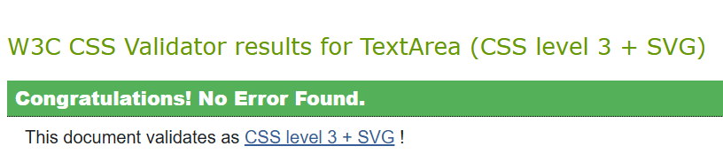
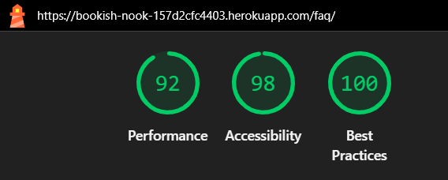

# ms4-Bookish Nook
Developer - Alexandra Holstensson

[Link to the project - Heroku](https://bookish-nook-157d2cfc4403.herokuapp.com/)


---

## [Table of Contents](#table-of-contents)
1. [**About**](#1-about)
2. [**User Goals**](#2-user-goals)
    - [**External User Goals**](#external-user-goals)
    - [**Site Owner Goals**](#site-owner-goals)
3. [**User Stories**](#3-user-stories)
    - [**User Stories - Site Visitors**](#user-stories---site-visitors)
        - [**Epic 1: User Account Management**](#epic-1-user-account-management)
        - [**Epic 2: Product Browsing And Search**](#epic-2-product-browsing-and-search)
        - [**Epic 3: Shopping Cart And Checkout**](#epic-3-shopping-cart-and-checkout)
        - [**Epic 4: Product Ratings And Reviews**](#epic-4-product-rating-and-reviews)
        - [**Epic 5: Product Wishlist Functionality**](#epic-5-product-wishlist-functionality)
        - [**Epic 6: Newsletter And Contact**](#epic-6-newsletter-and-contact)
    - [**User Stories - Administrator(s)**](#user-stories---administrators)
        - [**Epic 7: Site Administration**](#epic-7-site-administration)
4. [**Database Models Overview And Entity Relationship Diagram (ERD)**](#4-database-models-overview-and-entity-relationship-diagram-erd)
    - [**Database Models Overview**](#database-models-overview)
        - [**Explanation Of How The Models Are Connected To Each Other**](#explanation-of-how-the-models-are-connected-to-each-other)
    - [**Entity Relationship Diagram (ERD)**](#entity-relationship-diagram-erd)
5. [**Agile Methodology**](#5-agile-methodology)
    - [**User Story Prioritization - MoSCoW Method**](#user-story-prioritization---moscow-method)
    - [**Kanban Workflow**](#kanban-workflow)
6. [**Design Of The Website**](#6-design-of-the-website)
    - [**Structure**](#structure)
    - [**Wireframes**](#wireframes)
        - [**Mobile Wireframes**](#mobile-wireframes)
        - [**Tablet Wireframes**](#tablet-wireframes)
        - [**Laptop/Desktop Wireframes**](#laptopdesktop-wireframes)
    - [**Colors**](#colors)
    - [**Fonts**](#fonts)
    - [**Icons And Images**](#icons-and-images)
7. [**Existing Features**](#7-existing-features)
    - [**Existing Features - Site Visitors**](#existing-features---site-visitors)
        - [**Navigation And Footer**](#navigation-and-footer)
            - [**Navigation**](#navigation)
            - [**Footer**](#footer)
        - [**Home Page**](#home-page)
        - [**Create Account**](#create-account)
        - [**Login**](#login)
        - [**Logout**](#logout)
        - [**View Products**](#view-products)
        - [**Buy Product**](#buy-product)
        - [**View And Edit User Details**](#view-and-edit-user-details)
        - [**View Orders And Order Details**](#view-orders-and-order-details)
        - [**Search**](#search)
        - [**Read Information About Bookish Nook**](#read-information-about-bookish-nook)      
        - [**Contact Site Owner**](#contact-site-owner)
        - [**Read Frequently Asked Questions (FAQ)**](#read-frequently-asked-questions-faq)      
        - [**Sign Up For Newsletter**](#sign-up-for-newsletter)
    - [**Existing Features - Administrator(s)**](#existing-features---administrators)
        - [**View Products**](#view-products-1)
        - [**Add Product**](#add-product)
        - [**Edit Product Details**](#edit-product-details)
        - [**Delete Product**](#delete-product)
        - [**View Orders**](#view-orders)
        - [**Update Order Details**](#update-order-details)
8. [**Features Left To Implement**](#8-features-left-to-implement)
    - [**Features Left To Implement - Site Visitors**](#features-left-to-implement---site-visitors)
    - [**Features Left To Implement - Administrator(s)**](#features-left-to-implement---administrators)
9. [**Technologies Used**](#9-technologies-used)
    - [**Languages**](#languages)
    - [**Programs And Other Resources**](#programs-and-other-resources)
10. [**Testing**](#10-testing)
    - [**User Story Testing**](#user-story-testing)
    - [**Manual Testing - Site Visitors**](#manual-testing---site-visitors)
    - [**Manual Testing - Administrator(s)**](#manual-testing---administrators)
    - [**Automated Testing**](#automated-testing)
11. [**Bugs And Problems**](#11-bugs-and-problems)
12. [**Validation**](#12-validation)
    - [**HTML**](#html)
    - [**CSS**](#css)
    - [**JavaScript**](#javascript)
    - [**Python**](#python)
13. [**Lighthouse Testing**](#13-lighthouse-testing)
    - [**Desktop**](#desktop)
    - [**Mobile**](#mobile)
14. [**Device Testing**](#14-device-testing)
15. [**Browser Compatibility**](#15-browser-compatibility)
16. [**Deployment**](#16-deployment)
    - [**Local Deployment**](#local-deployment)
    - [**Remote Deployment**](#remote-deployment)
17. [**Credits**](#17-credits)

--- 

## 1. About
[Back To The Top](#table-of-contents)

Bookish Nook is made as part (Milestone Project 4) of the Level 5 Diploma in Web Application Development course at Code Institute.

Bookish Nook is a webshop that sells book accessories such as bookmarks, book sleeves, reading lights, bookends, stickers & sticky tabs, and smaller notebooks & pens.

---

## 2. User Goals
[Back To The Top](#table-of-contents)
### External User Goals

Visitors/users can view and, if they want to, purchase book accessories.

* Find and filter book accessories quickly (categories, search, sorting).
* See product details (price, picture, description) and available variations.
* Add products to cart, update quantity, delete.
* Smooth checkout with secure payment (Stripe) and email receipt.
* Create an account / log in to save address information and see order history.
* Subscribe to newsletter (with double opt-in).
* Contact the store via the contact form.

---

### Site Owner Goals
Create a demand for book accessories and make money selling these products.

* Add/edit/delete products and categories easily (Backoffice).
* View and manage incoming orders (status flow).
* See dashboard for quick mode (latest orders, totals).
* Switch the email list (Newsletter).
* Run stable operations with S3 (media), Postgres and Heroku.

---

## 3. User Stories
[Back To The Top](#table-of-contents)
### User Stories - Site Visitors
#### **Epic 1: User Account Management**
* **User Account Registration**
    * As a new user, I can register for an account so that I can access personal features.
* **Securely Log In With User Account**
    * As a registered user, I can log in and out so that I can access my account securely.
* **Change Password If Password Is Forgotten**
    * As a user I can reset my password so that I can access my account again.
* **Update User Details**
    * As a user, I can update my profile information so that my details are up to date.
* **View Order History**
    * As a user, I can view my order history so that I can track my purchases.

#### **Epic 2: Product Browsing And Search**
* **Display All Products**
    * As a customer, I can see all products so that I can browse the available items.
* **Search For Products**
    * As a customer, I can search for products so that I can find specific items.
* **Filter Products**
    * As a customer, I can filter products by category so that I can narrow down my options.
* **Sort Products According To Price Or Name**
    * As a customer, I can sort products by price or name so that I can organize the displayed items.
* **See Detailed Product Information**
    * As a customer, I can see detailed information about products so that I can make informed purchases.

#### **Epic 3: Shopping Cart And Checkout**
* **Adding Items To Cart**
    * As a customer, I can add products to my shopping cart so that I can purchase multiple items.
* **Change The Quantity Of An Item**
    * As a customer, I can change how many of a specific item I want to purchase so that I can change my order before placing it.
* **Securely Go Through Checkout**
    * As a customer, I can safely go to the checkout so that I can complete my purchase.
* **Receive An Order Confirmation Sent Via Email**
    * As a customer, I can receive an order confirmation so that I know that my purchase has gone through.

#### **Epic 4: Product Rating And Reviews**
* **See Other Customers' Ratings**
    * As a customer, I can see how other customers have rated a product so that I can see what they think about a product that I might be thinking of buying.
* **Rate Products**
    * As a registered user, I can rate products so that I can give my opinion about them.
* **Read Other Customers' Reviews**
    * As a customer, I can read other customers' reviews and ratings of products so that I can make informed decisions.
* **Leave Product Reviews**
    * As a registered user on the website, I can leave reviews about products so that I can share my experiences.

#### **Epic 5: Product wishlist functionality**
* **Add Products To Wishlist**
    * As a registered user of the website, I can add products that I like to my/a wishlist so that I can more easily see which products have interested me.
* **Edit Wishlist**
    * As a registered user on the website, I can edit my wish list so that I can remove products (or a wishlist) that I am no longer interested in.
* **Share Wishlist With Others**
    * As a registered user on the website, I can hare my wishlist, for example via e-mail or social media, so that I can easily let others know what I want for example as a birthday present, Christmas present etc.

#### **Epic 6: Newsletter And Contact**
* **Register To Receive Newsletters**
    * As a visitor to the website, I can add my email address so that I can receive a newsletter with information about new products, offers, etc.
* **Contact The Webshop Owner**
    * As a visitor to the site, I can fill out a contact form so that I can get in touch with the webshop owner.

---

### User Stories - Administrator(s)
#### **Epic 7: Site Administration**
* **View All Products**
    * As the administrator of the webshop, I can display a product list so that I can easily see all the webshop's products and their status.
* **Add New Products**
    * As the administrator of the webshop, I can add new products so that I can expand the assortment.
* **Update Product Details**
    * As the administrator of the webshop, I can edit product information so that I can keep it up to date.
* **Delete Products**
    * As the administrator of the webshop, I can delete products so that I can remove products from the webshop that are no longer sold.
* **Manage Order Status**
    * As the administrator of the webshop, I can manage placed orders so that I can process customers' purchases

---

## 4. Database Models Overview And Entity Relationship Diagram (ERD)
[Back To The Top](#table-of-contents)
### Database Models Overview
Description of the models that I use in my project.

- **App:** home
    - **Model name:**
        - NewsletterSubscriber
- **App:** orders
    - **Model names:**
        - Order
        - OrderItem
        - ProcessedStripeEvent
- **App:** products
    - **Model names:**
        - Category
        - Product
- **App:** profiles
    - **Model names:**
        - Profile
        - Address


- **home**
    - **NewsletterSubscriber**
        - **Purpose:** Manages newsletter subscribers including double opt-in and unsubscribe.
        - **Fields:**
            - email (EmailField, unique): Subscriber's email address
            - created_at (DateTime): When the record was created.
            - confirmed (Boolean): If the email address has been confirmed.
            - confirm_token (CharField, idx): Token for confirmation link.
            - confirm_sent_at / confirmed_at (DateTime): Dispatch and confirmation time.
            - unsubscribed (Boolean): Deregistered.
            - unsubscribe_token (CharField, idx): Token for unsubscribe link.
        - **Relations:** -    
        - **Note:** _Supports double opt-in flow (submit/validate token)._


- **orders**
    - **Order**
        - **Purpose:** Represents a placed order and its totals/status.
        - **Fields:**
            - created / updated (DateTime): Timestamps.
            - email (EmailField, null=True): Customer's email (may reflect user's).
            - total (Decimal): Subtotal (possibly excluding tax/shipping).
            - shipping (Decimal): Shipping cost.
            - tax_amount (Decimal): VAT/tax.
            - grand_total (Decimal): Final amount.
            - status (CharField): "pending" | "paid" | "cancelled".
            - stripe_session_id (CharField, null=True): Reference to Stripe session.
            - Shipping fields: full_name, phone, address_line1/2, postal_code, city, country (ISO2).
            - Billing fields: billing_name, billing_line1/2, billing_postal, billing_city, billing_country.
        - **Relations:**
            - items (OrderItem*): Lines in the order.
        - **Note:** _The status is updated via checkout/webhook. Total reflects cart at time of purchase._
    - **OrderItem**
        - **Purpose:** A single line in an order (snapshot of product + price at purchase).
        - **Fields:**
            - order (FK Order, CASCADE): Related orders.
            - product (FK Product, PROTECT): Referenced product.
            - name (CharField): Product name (copied for history).
            - unit_price (Decimal): Price per piece (snapshot).
            - qty (PositiveInteger): Quantity.
            - subtotal (Decimal): The row total (qty × unit_price).
        - **Relations:** product → Product, order → Order.
    - **ProcessedStripeEvent**
        - **Purpose:** Prevent duplicate side effects from Stripe (idempotence protection).
        - **Fields:**
            - event_id (Char, unique): The Stripe event ID.
            - created_at (DateTime, auto_now_add): When the event was marked as processed.
        - **Relations:** - (detached from other models; used by the webhook)


- **products**
    - **Category**
        - **Purpose:** Hierarchical product categories (root + subcategories).
        - **Fields:**
            - name (CharField), slug (SlugField): Name/slug.
            - parent (FK Category, null=True): For tree/nesting.
            - is_active (Boolean): Shown/hidden
            - is_featured (Boolean): If it should be displayed on the home page.
            - featured_order (PositiveInteger): Sorting on the home page (lowest first).
            - description (TextField): Description.
            - image (ImageField, null=True): Category image (S3 in production).
        - **Relations:**
            - children (Reverse FK Category): Subcategories.
            - products (Reverse FK Product): Products in the category.
    - **Product**
        - **Purpose:** Salable product in the store.
        - **Fields:**
            - category (FK Category, PROTECT): Category.
            - name (CharField), slug (SlugField, unique): Name/unique slug (can be auto-slugged).
            - description (Text): Description.
            - price (Decimal): Price.
            - image (ImageField, null=True): Product image (S3 in production).
            - is_active (Boolean): Shown/hidden in lists.
            - stock (PositiveInteger): Stock.
            - created/updated (DateTime): Timestamps.
        - **Relations:**
            - category → Category, is used by OrderItem.


- **profiles**
    - **Profile**
        - **Purpose:** Extended user information (customer data/newsletter).
        - **Field:**
            - user (OneToOne User): Connection to auth-user.
            - full_name (CharField), phone (CharField): Contact.
            - newsletter_opt_in (Boolean): Consent for the newsletter.
        - **Relations:** 
            - user → User.
        - **Note:** _Often created/maintained via signal at User creation._
    - **Address**
        - **Purpose:** Saved addresses per user (e.g. shipping/billing).
        - **Fields:**
            - user (FK User, CASCADE): Owner.
            - kind (CharField): Address Type (e.g. "shipping"|"billing").
            - full_name, phone (CharField): Contact field.
            - line1/line2 (CharField): Address lines.
            - postal_code (CharField), city (CharField), country (CharField, ISO2): City/country.
            - is_default (Boolean): Default address for selected type.
        - **Relations:**
            - user → User. Multiple addresses per user.


- **User (Django auth.User)**
    - **Purpose:** Built-in user model for authentication/permissions.
    - **Fields (common and important):**
        - username (Char, unique, required): Inloggnings-ID (if you have not changed to custom user).
        - password (Char, required): Hashed password (Django PBKDF2/Argon2 etc.).
        - email (Email): User's email (can be unique if set).
        - first_name, last_name (Char): Name field (optional).
        - is_active (Bool, default=True): If the account is active.
        - is_staff (Bool): Access to Django admin.
        - is_superuser (Bool): Full permissions.
        - last_login (DateTime): Last login.
        - date_joined (DateTime, auto): When the account was created.
    - **Relations:**
        - 1–1 → Profile (your app).
        - 1–* → Address (one user can have multiple addresses (for example, different shipping and billing addresses)).

---

#### Explanation Of How The Models Are Connected To Each Other

The database design of Bookish Nook supports the complete shopping flow, from product browsing to checkout and order management.

- **Products & Categories**
    - Products are organized into a hierarchical category tree. Each Category can have child categories, featured ordering, and an optional image. A Product belongs to one category and contains details such as name, description, price, stock, and image. This structure ensures products can be browsed both by category and through search/sorting.
- **Orders & Checkout**
    - An Order represents a completed purchase. It stores customer contact details, shipping and billing addresses, totals, and payment status. Each order has multiple OrderItems, which snapshot the product’s name, price, and quantity at the time of purchase. This ensures historical accuracy even if a product is later updated or removed.
    - The checkout process integrates with Stripe for secure payments. To prevent duplicate side effects from Stripe retrying the same webhook multiple times, the ProcessedStripeEvent model tracks each processed event ID. This guarantees that order confirmations, stock updates, and payment status changes are executed only once, maintaining data consistency and reliability.
- **Profiles & Addresses**
    - Each User automatically gets a linked Profile, which holds extended information such as full name, phone number, and newsletter preferences. Users can also save multiple Address entries (shipping/billing), which makes repeat purchases faster and more convenient.
- **Newsletter Subscribers**
    - The NewsletterSubscriber model manages opt-in/opt-out states for visitors who want to receive newsletters. It supports a double opt-in workflow using confirmation and unsubscribe tokens, ensuring compliance with best practices for email marketing.
- **User (Django auth)**
    - Django’s built-in User model is extended through Profile and Address. Authentication is handled with email-based login, and users can view/edit their profile, orders, and addresses via the frontend.

Together, these models form a consistent flow:
User → Profile & Addresses → Products (via Category) → Cart → Order & OrderItems → ProcessedStripeEvent (webhook protection).
This allows both customers and administrators to interact with the store efficiently, while maintaining data integrity and scalability.

---

### Entity Relationship Diagram (ERD)

I used [diagrams](https://app.diagrams.net/) to create an Entity Relationship Diagram (ERD). The relationships between the models are drawn.

The ERD illustrates how the models in Bookish Nook are connected:

- **User (Django auth)**
    - One-to-One → Profile (each user has one profile)
    - One-to-Many → Address (each user can store multiple addresses)
- **Profile**
    - Extends the built-in User with extra information (full name, phone, newsletter opt-in).
- **Address**
    - Belongs to a User.
    - Can represent both billing and shipping addresses (kind field).
- **Category**
    - Can have a parent category (self-referential relationship).
    - One-to-Many → Product (each category can contain many products).
- **Product**
    - Belongs to a single Category.
    - One-to-Many → OrderItem (a product can appear in many order items).
- **Order**
    - Contains customer details, shipping, billing, and totals.
    - One-to-Many → OrderItem (each order contains one or more order items).
- **OrderItem**
    - Belongs to one Order.
    - Linked to a Product (with product name/price stored as snapshot).
- **NewsletterSubscriber**
    - Independent model.
    - Stores email, confirmation tokens, and unsubscribe status.
- **ProcessedStripeEvent**
    - Belongs to the webhook flow but is not directly connected to the Order model with FK (Foreign Key).
---

**Image of Entity Relationship Diagram (ERD)**


The image of the ERD can be found here: docs/images/erd/bookish_nook_erd3.drawio.png

---

## 5. Agile Methodology
[Back To The Top](#table-of-contents)

While the development process primarily followed an iterative and practical workflow, the user stories and task structure are presented below using the MoSCoW and Kanban methods to clearly document prioritization and progress. These reflect the project’s actual feature planning and implementation order.

### User Story Prioritization - MoSCoW Method

I have used the MoSCoW method to prioritize user stories/features.

Each feature was classified as a **Must Have**, **Should Have**, **Could Have**, or **Won't Have (This Iteration)**, based on its importance to the project's core functionality, user experience, and technical feasibility.

**Must Have**
| User Story                                                                                      | Feature / Area   | Status |
| ----------------------------------------------------------------------------------------------- | ---------------- | ------ |
| As a new user, I can register for an account so that I can access personal features. | User Account Management  | ✅ Done |
| As a registered user, I can log in and out so that I can access my account securely. | User Account Management  | ✅ Done |
| As a user I can reset my password so that I can access my account again. | User Account Management | ✅ Done |
| As a customer, I can see all products so that I can browse the available items. | Product Browsing And Search | ✅ Done |
| As a customer, I can search for products so that I can find specific items. | Product Browsing And Search | ✅ Done |
| As a customer, I can filter products by category so that I can narrow down my options. | Product Browsing And Search | ✅ Done |
| As a customer, I can sort products by price or name so that I can organize the displayed items. | Product Browsing And Search | ✅ Done |
| As a customer, I can see detailed information about products so that I can make informed purchases. | Product Browsing And Search | ✅ Done |
| As a customer, I can add products to my shopping cart so that I can purchase multiple items. | Shopping Cart And Checkout | ✅ Done |
| As a customer, I can change how many of a specific item I want to purchase so that I can change my order before placing it. | Shopping Cart And Checkout | ✅ Done |
| As a customer, I can safely go to the checkout so that I can complete my purchase. | Shopping Cart And Checkout | ✅ Done |
| As a customer, I can receive an order confirmation so that I know that my purchase has gone through. | Shopping Cart And Checkout | ✅ Done |

---

**Should Have**
| User Story                                                                     | Feature / Area       | Status |
| ------------------------------------------------------------------------------ | -------------------- | ------ |
| As a user, I can update my profile information so that my details are up to date. | User Account Management | ✅ Done |
| As a user, I can view my order history so that I can track my purchases. | User Account Management | ✅ Done |
| As a customer, I can filter products by category so that I can narrow down my options. | Product Browsing And Search | ✅ Done |
| As a customer, I can sort products by price or name so that I can organize the displayed items. | Product Browsing And Search | ✅ Done |
| As a visitor to the website, I can add my email address so that I can receive a newsletter with information about new products, offers, etc. | Newsletter And Contact | ✅ Done |
| As a visitor to the site, I would like to be able to fill out a contact form so that I can get in touch with the webshop owner. | Newsletter And Contact | ✅ Done |

---

**Could Have**
| User Story                                                                             | Feature / Area      | Status              |
| -------------------------------------------------------------------------------------- | ------------------- | ------------------- |
| As the owner of the webshop, I can display a product list so that I can easily see all the webshop's products and their status. | Site Administration | ✅ Done |
| As the administrator of the webshop, I can add new products so that I can expand the assortment. | Site Administration | ✅ Done |
| As the administrator of the webshop, I can edit product information so that I can keep it up to date. | Site Administration | ✅ Done |
| As the administrator of the webshop, I can edit product information so that I can keep it up to date. | Site Administration | ✅ Done |
| As the administrator of the webshop, I can manage placed orders so that I can process customers' purchases. | Site Administration | ✅ Done |

---

**Won’t Have (This Iteration)**
| User Story                                                                        | Feature / Area | Status                               |
| --------------------------------------------------------------------------------- | -------------- | ------------------------------------ |
| As a customer, I can see how other customers have rated a product so that I can see what they think about a product that I might be thinking of buying. | Product Rating And Reviews | 🚫 Deferred (planned future feature) |
| As a registered user, I can rate products so that I can give my opinion about them. | Product Rating And Reviews | 🚫 Deferred (planned future feature) |
| As a customer, I can read other customers' reviews and ratings of products so that I can make informed decisions. | Product Rating And Reviews | 🚫 Deferred (planned future feature) |
| As a registered user on the website, I can leave reviews about products so that I can share my experiences. | Product Rating And Reviews | 🚫 Deferred (planned future feature) |
| As a registered user of the website, I would like to be able to add products that I like to my/a wishlist so that I can more easily see which products have interested me. | Product Wishlist Functionality | 🚫 Deferred (planned future feature) |
| As a registered user on the website, I would like to be able to edit my wish list so that I can remove products (or a wishlist) that I am no longer interested in. | Product Wishlist Functionality | 🚫 Deferred (planned future feature) |
| As a registered user on the website, I want to be able to share my wishlist, for example via e-mail or social media, so that I can easily let others know what I want for example as a birthday present, Christmas present etc. | Product Wishlist Functionality | 🚫 Deferred (planned future feature) |

---

### Kanban Workflow

I have used a Kanban board to structure the work on the website. In the Kanban board, I have chosen to divide all tasks (issues) into four different stages:

* **To Do** – Features or tasks planned for implementation.
* **In Progress** – Currently being developed or tested.
* **Done** – Completed and merged features.
* **Won’t Have (This Iteration)** – Deferred features are considered outside the scope of the current version.

🔗 View the live Kanban board on GitHub: [Bookish Nook Project Board](https://github.com/users/AlexandraH-code/projects/13)

---

## 6. Design Of The Website
[Back To The Top](#table-of-contents)
### Structure

The website's pages consist of three different parts: header, main (where the main content of a page is placed) and footer. The header and footer look the same on all pages.

I have chosen to structure my website with the following pages:
- **Home Page:**
    - Home page that contains a large hero image with a button that says "See All Products". Below the hero image you can see images/links to four of the website's product categories.
- **All Products Page:**
    - Page that lists all available products.
- **Product Detail Page:**
    - A page that displays detailed information about a specific product. You can get to the product details page by clicking on a product on the page that lists all available products.
- **About Us:**
    - A page that contains information about the website.
- **Contact Us:** 
    - Contains a contact form that the visitor can fill out if they want to get in touch with the website owner.
- **FAQ:**
    - A page with frequently asked questions that have been asked to the website owner.
- **Create account:**
    - Create account contains a form with fields for email address, password, password confirmation and a Sign up button. The page also contains a Sign in link (if you have already registered an account on the website). The page is displayed as a modal when you click Sign in in the menu.
- **Sign in:**
    - Sign in contains a form with fields for email address and password and a Sign in button. The page also has links to Forgot password (if you have forgotten your password) and Create account (if you do not have an account yet). The page is displayed as a modal when you click Sign in in the menu.
- **Logout:**
    - Logout contains a Log out button.
- **My Account:**
    - On the My Account page you can change your user details, change your password, manage addresses and view any orders.
- **Backoffice:**
    - On the Backoffice page, you can see the number of orders and a list of recently placed orders. There are also buttons that go to pages where an administrator can view and manage orders and view and manage products. There is also a button that goes to Django Admin.

The pages above can be accessed by clicking on one of the links in the menu bar at the top of the page or in the footer at the bottom of the page.. On small screens (smaller than 992 pixels) the menu is collapsed in the upper left corner. 

---

### Wireframes

I used the program [Balsamiq](https://balsamiq.com/) to create wireframes for my website. The wireframes show how I planned the website to look and be constructed. The finished website may differ slightly from the wireframes.

I have divided the wireframes into three different sections: mobile, tablet and desktop.

#### Mobile Wireframes

  <details>
  <summary>Home Page - Not Logged In</summary>

  
  
  </details>
  
  <details>
  <summary>Home Page - Logged In</summary>

  
  
  </details>
  
  <details>
  <summary>Sale</summary>

  
  
  </details>
  
  <details>
  <summary>Products</summary>

  
  
  </details>
  
  <details>
  <summary>Product Details</summary>

  
  
  </details>
  
  <details>
  <summary>Contact</summary>

  
  
  </details>
  
  <details>
  <summary>About Us</summary>

  
  
  </details>
  
  <details>
  <summary>FAQ</summary>

  
  
  </details>

---

#### Tablet Wireframes

  <details>
  <summary>Home Page - Not Logged In</summary>

  
  
  </details>
  
  <details>
  <summary>Home Page - Logged In</summary>

  
  
  </details>
  
  <details>
  <summary>Sale</summary>

  
  
  </details>
  
  <details>
  <summary>Products</summary>

  
  
  </details>
  
  <details>
  <summary>Product Details</summary>

  
  
  </details>
  
  <details>
  <summary>Contact</summary>

  
  
  </details>
  
  <details>
  <summary>About Us</summary>

  
  
  </details>
  
  <details>
  <summary>FAQ</summary>

  
  
  </details>

---

#### Laptop/Desktop Wireframes

  <details>
  <summary>Home Page - Not Logged In</summary>

  
  
  </details>
  
  <details>
  <summary>Home Page - Logged In</summary>

  
  
  </details>
  
  <details>
  <summary>Sale</summary>

  
  
  </details>
  
  <details>
  <summary>Products</summary>

  
  
  </details>
  
  <details>
  <summary>Product Details</summary>

  
  
  </details>
  
  <details>
  <summary>Contact</summary>

  
  
  </details>
  
  <details>
  <summary>About Us</summary>

  
  
  </details>
  
  <details>
  <summary>FAQ</summary>

  
  
  </details>

---

### Colors

The color palette was chosen to create a cozy, book-inspired atmosphere with warm earthy tones and soft accents.  

| Color | Hex | Example |
|-------|-----|---------|
| **Primary Brown** | `#5A3825` | <span style="display:inline-block;width:40px;height:20px;background:#5A3825;border:1px solid #ccc;"></span> |
| **Cream** | `#FFF8F0` | <span style="display:inline-block;width:40px;height:20px;background:#FFF8F0;border:1px solid #ccc;"></span> |
| **Sage** | `#A3B18A` | <span style="display:inline-block;width:40px;height:20px;background:#A3B18A;border:1px solid #ccc;"></span> |
| **Rose** | `#D8A7B1` | <span style="display:inline-block;width:40px;height:20px;background:#D8A7B1;border:1px solid #ccc;"></span> |
| **Dark Dropdown Brown** | `#4A2F21` | <span style="display:inline-block;width:40px;height:20px;background:#4A2F21;border:1px solid #ccc;"></span> |
| **Text** | `#333333` | <span style="display:inline-block;width:40px;height:20px;background:#333333;border:1px solid #ccc;"></span> |

> **Design rationale:**  
> The deep brown provides a strong, warm foundation, while cream ensures a light and comfortable background for reading. Sage green and rose pink were introduced as *accent colors* — sage conveys calmness and nature, while rose adds a soft, welcoming warmth. These subtle contrasts prevent the design from feeling flat and reinforce the cozy “book nook” aesthetic.

---

### Fonts

The project uses two complementary Google Fonts:  

- **Playfair Display (serif)** – used for titles, headings, and the brand logo.  
- **Lato (sans-serif)** – used for body text and general content.  

> **Design rationale:**  
> *Playfair Display* was chosen for its elegant and slightly decorative style, giving a classic “bookish” feeling that works well for headings and brand identity. Its contrast in stroke weight creates a timeless impression reminiscent of printed literature.  
>  
> *Lato* was selected as the primary body font because of its modern, clean, and highly readable design. This ensures that product descriptions, instructions, and longer text blocks remain easy to read on both desktop and mobile.  
>  
> Together, these fonts balance **warmth and elegance** with **clarity and readability**, reinforcing the bookstore-inspired aesthetic of *Bookish Nook*.  

--

### Icons And Images

The icons used on the website come from [Font Awesome](https://fontawesome.com/).

As for the images I use on the website, they come from a variety of different sites. The hero image on the front page comes from [Pixabay](https://pixabay.com/). I borrowed the category images on the home page and the product images (and also product details) from two Swedish websites that sell book accessories: [Bokvännen](https://www.bokvannen.se/) and [Power of books](https://www.powerofbooks.se/). I also have a placeholder image (which is used if there is no image to insert). That image comes from [Wikimedia Commons](https://commons.wikimedia.org/wiki/Main_Page). Under Credits I will make a compilation of all the website's images and show where they are borrowed from.

---

## 7. Existing Features
[Back To The Top](#table-of-contents)

I have chosen to divide Existing Features into **Existing Features - Site Visitors** and **Existing Features - Administrator(s)**.

### Existing Features - Site Visitors
[Back To The Top](#table-of-contents)
#### Navigation And Footer

##### **Navigation**

The menu/navbar (navigation) can be found in the header. The header is divided into three rows.
- **Top row:** consists of a banner with links to Instagram and Facebook
- **Middle row (from left to right):** consists of Search function, Page title, link to Create Account, Login, Logout, My Account and/or Backoffice (depending on whether the visitor is logged in or not and whether the logged in person has administrator rights or not) + shopping cart.
- **Bottom row:** Links to the website's product categories.

The navbar consists of the two bottom rows. On smaller screens (less than 992 px), the navbar changes appearance. The text field for Search disappears and you only se the magnifying glass (to show the text field you have to click on the magnifying glass).

The links available in the navbar for all visitors to the site are:

* Product categories which are divided as follows:
    * **Book Sleeves**
    * **Bookends**
    * **Bookmarks**, with the subcategories:
        * **Bookmark In Vegan Leather**
        * **Bookmark With Elastic Band**
        * **Bookmark With Tassel**
        * **Fabric Bookmark**
        * **Magnetic Bookmark**
        * **Metal Bookmark**
        * **Wooden Bookmark**
    * **Pens & Notebooks**
    * **Reading Lights**
    * **Stickers & Sticky Tabs**

Which other links you see depend on whether you are logged in or not and whether you are a regular visitor or an administrator.

For a visitor who is **not** logged in, links for **Sign In** and **Create Account** are displayed.
On smaller screens (less than 992 px), the links for **Sign in** and **Create account** are at the bottom of the collapsed menu.

For a regular visitor who is logged in, links are displayed for **My Account** and **Logout**.
On smaller screens (less than 992 px), the links for **My Account** and **Logout** are at the bottom of the collapsed menu.

For a logged in administrator, links are displayed for **Backoffice**, **My Account** and **Logout**.
On smaller screens (less than 992 px) the links for **Backoffice**, **My Account** and **Logout** are at the bottom of the collapsed menu.


The nav bar is from [Bootstrap](https://getbootstrap.com/). I have used a navbar from Bootstrap. I have then modified it to look the way I want it to.

**Images of the navbar - screens that are 992px or larger:**

**Visitor not logged in:**


**Logged in as a regular visitor:**


**Logged in as administrator:**


**Images of the navbar - screens that are 991px or smaller:** (the links in the navbar become a toggle menu on the left of the navbar). I choose here to show how the navbar looks on mobile screens.

**Visitor not logged in:**


**Logged in as a regular visitor:**


**Logged in as administrator:**


---

##### **Footer** 

The footer contains quick links (**About Us**, **Contact** and **FAQ**), **newsletter sign-up** and **links to social media** (Instagram and Facebook). The footer also contains a copyright symbol, year, and the text Bookish Nook.

**Image of the footer - screens that are 992px or larger:**


**Image of the footer - screens that are  991px or smaller:**


---

#### Home Page

Home page that contains a large hero image with a button that says "See All Products". Below the hero image you can see images/links to four of the website's product categories. These four images can easily be replaced with other category images via Django Admin.

**Images of Home Page - screens that are 768px or larger:**


**Images of Home Page - screens that are 767px or smaller:**


---

#### Create Account

When you click Create Account, a modal opens. In it, you fill in your email address and password * 2. To register the account, you then click Sign up. If you already have an account, you can instead choose to click Sign in. In order to register an account, you must fill in all the fields. If you click Sign up without having filled in all the fields, a message appears telling you that you need to fill in the field that is not filled in. If you click Sign up without having filled in the same password in both password fields (or if the passwords do not follow the password rules), you will receive a message that the passwords must be the same in both password fields. The modal also contains password rules. The modal looks the same regardless of the type of device and screen size you are using.

**Image of Create Account modal:**


---

#### Login

If you click on Login, a modal will open, just like when you click on Create Account. In the modal, you fill in your email address and password and then click Sign in. If you happen to click on Login without having an account, you can click on the Create account link in the modal. If you have forgotten your password, you can click the Forgot your password link. You can also check the Remember Me checkbox if you want your login information to be saved so that you do not have to remember it. When you click Sign in and have logged in to the page, a message will appear confirming that you are logged in.

**Image of Login modal:**


---

#### Logout

If you click Logout, you will be taken to a page with a Log out button. If you click on it, you will be logged out of the page. When you are logged out, a message will appear confirming that you are logged out.

**Image of Logout:**


---

#### View Products

To view products, you can click on the See All Products button located on the hero imagen on the Home Page. You can also click on any of the four product categories located under the hero imagen on the Home Page. Or you can click on any of the product categories located in the navbar. If you click on the See All Products button on the Home Page, you will be taken to a page where all products are listed. If you click on any of the four product categories displayed on the Home Page, the products that belong to that particular product category will be displayed. If you choose to click on any of the product categories in the navbar, products in that particular product category will be displayed.

On the page where the products are listed, there is a search function. There is also the option to sort the products alphabetically (A to Z, Z to A), by (Low to High, High to Low), newest items and oldest items. There are also buttons for the different product categories (how they are displayed here is controlled by the width of the screen)

The products are displayed with a picture of the product, product name, product category and price (since I live in Sweden, I have chosen to have the price in Swedish kronor, SEK). To view product details for a specific product, click the View button.

Below are two images showing what All Products looks like on a mobile phone.


Image of search for lamp:


**Images of sorting of products:**

**A->Z:**


**Z->A:**


**Lowest -> highest price:**


**Highest -> lowest price:**


**Newest:**


**Oldest:**


**Clicked on the Stickers & Sticky Tabs button:**


---

#### Buy Product

To buy a product, click on the View button on the product you are interested in on the product listing page. This will take you to a product detail page where you can find more information about the product. The product information is displayed with the product name, product category, price and product description. The product detail page displays other products within the same product category. To buy the item, enter the quantity (1 is entered by default) and then click on the Add to cart button.


To view your shopping cart, click on the shopping cart icon. This will take you to Your Cart. Here you can adjust the number of items and remove an item if you wish. To proceed with your order, click on the Checkout button.


You will now be taken to the Checkout page where you will see a summary of your order and the costs involved. To proceed to payment, click Proceed to payment. If you want to go back to the shopping cart, click Back to cart.


Once you have clicked Proceed to payment, you will be taken to Stripe's payment solution. Here you will see a summary of your order and how much you will pay for your goods. Here you also fill in delivery information (it is possible to have a delivery address and a billing address) and choose a payment method. To continue, click the Pay button.


After the payment has been processed, you will be returned to Bookish Nook where you will see a confirmation that your order has been processed. An order confirmation will also be sent to the email address you provided in the Stripe form.


Below are some images of what it looks like in Django Admin when an order has been placed.

Order in Orders:


Order details:


Stock changed in Products:


---

#### View And Edit User Details

Logged in users can view and edit their details (name, phone, newsletter). Addresses can be added, updated or deleted.

**Images from My Account:**

Logged in user:


Edit Profile


My Addresses


Change Password


---

#### View Orders and Order Details

Under “My Orders” in My Account all previous purchases are displayed. Each order shows the date, status, products and totals.

My Orders


Order details (also possible to see shipping address and billing address):


---

#### Search

In the navbar, to the left of the Bookish Nook text, there is a search function. If you enter a search term and then click on the magnifying glass, you will be sent to the All Products page where the search results are displayed. What is displayed is exactly what you have searched for.

Search term lamp


Search result lamp


---

#### Read Information About Bookish Nook 

To read information about Bookish Nook, click on About Us, which is located under Quicklinks in the footer.

About Us text


---

#### Contact Site Owner

On Contact there is a form where visitors can send messages to the website owner. The form contains honeypot and limits the number of attempts per user. In order for the form to be submitted, all fields must be filled in. If any field is not filled in, a message will appear telling you which field(s) need to be filled in. A confirmation is displayed after successful submission.

Image: Contact form


Image: Contact form error message


Image: Contact confirmation message


Image: Message sent to Bookish Nooks email address


---

#### Read Frequently Asked Questions (FAQ)

The visitor can read frequently asked questions by clicking on FAQ under Quick links in the footer.

Image of FAQ - (The FAQ contains more questions, but I choose here to show the idea behind it.)


---

#### Sign Up For Newsletter

Visitors can enter their email address to subscribe. A confirmation email is sent (double opt-in). The newsletter subscription can be canceled via an “unsubscribe” link.

Image: Newsletter form


Image: Newsletter confirmation message confirmation mail sent


Image: Newsletter confirmation mail


Image: Newsletter subscribed confirmation message


Image: Newsletter unsubscribed message


---

### Existing Features - Administrator(s)
[Back To The Top](#table-of-contents)
#### View Products

Admin sees a table of products, including category, price, status and stock. Filters and search are available for easy management.

Image of product list


Image of product search - search term "lamp"


Image of product search - search term "metal bookmark"


Image of inactive products (Products that the admin has chosen to set as inactive and products where the stock balance is zero.)


---

#### Add Product

To add a new product, Admin clicks the New Product button in the Backoffice Dashboard. Admin will then be taken to a form where they can fill in the details of the new product. Slug is automatically generated, and stock can be entered directly. Image and active status can be set.


Image of New Product form - part 1


Image of New Product form - part 2


Image of confirmation message for added product


Image of search for added product


---

#### Edit Product Details

Admin can update information such as price, stock, description and status on existing products.

Image of edit form


Image of updated information - price


Image of confirmation message for updated product


Image of updated product


---

#### Delete Product

Admin can delete existing products that, for example, are no longer to be sold. Product deletion is done with confirmation to avoid mistakes.

Image of product to be deleted


Image of warning message for product to be deleted


Image of message confirming product deletion


---

#### View Orders

Admin can both view placed orders and open an order to see order details such as customer information, products, totals and payment status.

Image of Backoffice Dashboard


Image of Orders


Image of Orders


Image of Order details


Image of Order details


Image of Order details


---

#### Update Order Status

Admin can change order status (for example from “pending” to “cancelled”), which updates the order history.

Image of Order details - pending


Image of Order details - pending


Image of updated status - from pending to cancelled


Image of cancelled order


---

## 8. Features Left To Implement
[Back To The Top](#table-of-contents)
In addition to the features that are currently added to the website, I have come up with some other features that could be added in the future. I have divided the features into Features Left To Implement - Site Visitors and Features Left To Implement - Administrator(s).

---

### Features Left To Implement - Site Visitors

- Possibility for site visitors to:
    - see average ratings for each product.
    - rate products.
    - see written reviews
    - leave written reviews about products.

---

### Features Left To Implement - Administrator(s)

- Possibility for the website administrator to update information on the About and FAQ pages via the website administrator part (Backoffice) or Django Admin.
- Add database connection to the contact form so that submitted messages can be viewed via Django Admin and/or Backoffice.

---

## 9. Technologies Used
[Back To The Top](#table-of-contents)
### Languages

- [HTML5](https://en.wikipedia.org/wiki/HTML) - Used to create the foundation of all subpages on the website.
- [CSS](https://en.wikipedia.org/wiki/CSS) - Used to style the website and to get content to end up in the right place.
- [JavaScript](https://en.wikipedia.org/wiki/JavaScript) - Scripting language used to achieve the star rating and "reply to comment" form on the Book Detail page.
- [Python3](https://en.wikipedia.org/wiki/Python_(programming_language)) - Programming language that (together with Django) was used to create the website.

---

### Programs And Other Resoures
- [Django](https://www.djangoproject.com/) - a high-level Python web framework that was used to create the website/web application.
- [PostgreSQL](https://www.postgresql.org/) - The database used on the website is a PostgreSQL database.
- [Bootstrap, v4.6](https://getbootstrap.com/) - Used Boostrap to structure the pages and used some Bootstrap elements to style the site.
- [Heroku](https://www.heroku.com/) - The website is deployed to Heroku.
- [Visual Studio Code](https://code.visualstudio.com/) - Program used to code the website.
- [Git](https://git-scm.com/) - Mainly used to save the website to GitHub.
- [GitHub](https://github.com/) - GitHub is the place where my website (repository) is stored.
- [Responsinator](http://www.responsinator.com/) - Used to check how the site looks on different devices and how responsive it is.
- [Am I Responsive](https://ui.dev/amiresponsive) - Used to check how the site looks on different devices and how responsive it is.
-[Responsive Web Design Checker](https://responsivedesignchecker.com/) - Used to see how my website looks on different types of devices and screen sizes.
- [tinypng](https://tinypng.com/) - Used to compress images.
- [HTML Validator](https://validator.w3.org/nu/) - Used to validate the HTML files.
- [CSS Validator](https://jigsaw.w3.org/css-validator/) - Used to validate the JavaScript code.
- [Site24x7's JavaScript validator](https://www.site24x7.com/tools/javascript-validator.html) - Used to validate the JavaScript code.
- [JShint](https://jshint.com/) - Used to validate the JavaScript Code.
- [Fontawesome](https://fontawesome.com/) - For all the icons)
- [Google Fonts](https://fonts.google.com/) - Was used to download the fonts that I have chosen to use (Playfair Display and Lato)
- [Google Transate](https://translate.google.com/) - Was used to translate text for accuracy.
- [diagrams](https://app.diagrams.net/) - Was used to create the Entity Relationship Diagram
- [W3Schools HTML Tutorial](https://www.w3schools.com/html/default.asp) - Used to check things related to HTML.
- [W3Schools CSS Tutorial](https://www.w3schools.com/css/default.asp) - Used to check things related to CSS.
- [W3Scools Python Tutorial](https://www.w3schools.com/python/default.asp) - Used to check things related to Python.
- [Django Documentation](https://docs.djangoproject.com/en/5.2/) - Used to check things related to Python. 
- [chatGPT](https://chatgpt.com/) - Got help with the scripts for newsletter and modals for creating an account and logging in.

---

## 10. Testing
[Back To The Top](#table-of-contents)
### User Story Testing

#### User Story Testing - Site Visitors

| Feature | User Story | Expected Result | Pass |
|---------|------------|-----------------|------|
| Create Account | **User Account Registration:** As a new user, I can register for an account so that I can access personal features. | A new user can create a new account.| &check; |
| Login | **Securely Log In With User Account:** As a registered user, I can log in and out so that I can access my account securely.| A registered user can log in to their account. | &check; |
| Change password | **Change Password If Password Is Forgotten:** As a user I can reset my password so that I can access my account again.| If a password is forgotten, a registered user can set a new one.| &check; |
| Update User Details | **Update User Details:** As a user, I can update my profile information so that my details are up to date.| A registered user can change their user details if necessary.| &check; |
| View Recent Orders | **View Order History:** As a user, I can view my order history so that I can track my purchases.| A registered user can view previously placed orders as well as order details for those orders.| &check; |
| View All Products | **Display All Products:** As a customer, I can see all products so that I can browse the available items.| A customer can see all the items that have been added to the webshop.| &check; |
| Search Function | **Search For Products:** As a customer, I can search for products so that I can find specific items.| A customer can, for example, search by product type, name, etc.| &check; |
| Filtering Function | **Filter Products:** As a customer, I can filter products by category so that I can narrow down my options.| A customer can choose to view products by product type, for example bookmarks, bookends, reading lamps, etc.| &check; |
| Sorting Function | **Sort Products According To Price Or Name:** As a customer, I can sort products by price or name so that I can organize the displayed items.| A customer can filter products by Name (A to Z, Z to A), Price (ascending/descending) and by Newest/Oldest| &check; |
| See Detailed Product Information | **See Detailed Product Information:** As a customer, I can see detailed information about products so that I can make informed purchases.| A customer can view detailed product information by clicking the View button on a specific item.| &check; |
| Add Item(s) To Cart | **Adding Items To Cart:** As a customer, I can add products to my shopping cart so that I can purchase multiple items.| A customer can add several different products to the cart.| &check; |
| Update Quantity Of Items In The Cart | **Change The Quantity Of An Item:** As a customer, I can change how many of a specific item I want to purchase so that I can change my order before placing it.| A customer can easily change the quantity of an item before completing the order.| &check; |
| Secure Payment Procedure | **Securely Go Through Checkout:** As a customer, I can safely go to the checkout so that I can complete my purchase.| A customer ordering goods can go through a secure payment procedure. | &check; |
| Receive An Order Confirmation | **Receive An Order Confirmation Sent Via Email:** As a customer, I can receive an order confirmation so that I know that my purchase has gone through.| A customer receives an order confirmation via email that shows that an order has been processed as expected. | &check; |
| See other customers' ratings | **See Other Customers' Ratings:** As a customer, I can see how other customers have rated a product so that I can see what they think about a product that I might be thinking of buying.| Not applicable | Not included in this iteration |
| Rate Products | **Rate Products:** As a registered user, I can rate products so that I can give my opinion about them.| Not applicable | Not included in this iteration |
| Read Other Customers' Reviews | **Read Other Customers' Reviews:** As a customer, I can read other customers' reviews and ratings of products so that I can make informed decisions.| Not applicable | Not included in this iteration |
| Leave Product Reviews | **Leave Product Reviews:** As a registered user on the website, I can leave reviews about products so that I can share my experiences.| Not applicable | Not included in this iteration |
| Add Products To Wishlist | **Add Products To Wishlist:** As a registered user of the website, I can add products that I like to my/a wishlist so that I can more easily see | Not applicable. | Not included in this iteration |
| Edit Wishlist | **Edit Wishlist:** As a registered user on the website, I can edit my wishlist so that I can remove products (or a wishlist) that I am no longer interested in. | Not applicable | Not included in this iteration |
| Share Wishlist With Others | **Share Wishlist With Others:** As a registered user on the website, I want to be able to share my wishlist, for example via e-mail or social media, so that I can easily let others know what I want for example as a birthday present, Christmas present etc. | Not applicable | Not included in this iteration |
| Register To Receive Newsletters | **Register To Receive Newsletters:** As a visitor to the website, I can add my email address so that I can receive a newsletter with information about new products, offers, etc.| A visitor to the website can register their email address to receive newsletters. | &check; |
| Contact The Webshop Owner | **Contact The Webshop Owner:** As a visitor to the site, I would like to be able to fill out a contact form so that I can get in touch with the webshop owner. | A visitor to the website can contact the website owner by filling out a contact form that can be sent to the website owner. | &check; |

---

#### User Story Testing - Administrator(s)

| Feature | User Story | Expected Result | Pass |
|---------|------------|-----------------|------|
| View All Products | **View All Products:** As the owner of the webshop, I can display a product list so that I can easily see all the webshop's products and their status. | An administrator can see all products added to the webshop in the Backoffice Dashboard.| &check; |
| Add New Products | **Add New Products:** As the administrator of the webshop, I can add new products so that I can expand the assortment. | An administrator can add new products to the webshop in the Backoffice Dashboard. | &check; |
| Update Product Details | **Update Product Details:** As the administrator of the webshop, I can edit product information so that I can keep it up to date. | An administrator can change information on an existing product in the Backoffice Dashboard. | &check; |
| Delete Products | **Delete Products:** As the administrator of the webshop, I can delete products so that I can remove products from the webshop that are no longer sold. | An administrator can delete an existing product in the Backoffice Dashboard.| &check; |
| Manage Order Status | **Manage Order Status:** As the owner of the webshop, I can manage placed orders so that I can process customers' purchases. | An administrator can change the status of an order in the Backoffice Dashboard. | &check; |


---

### Manual Testing - Site Visitors

| Area          | Scenario                             | Steps                              | Expected Result                          | Actual Result | Pass/Fail |
| ------------- | ------------------------------------ | ---------------------------------- | ---------------------------------------- | ------------- | --------- |
| Navigation    | Navbar links (logged in/out)         | Toggle login state and check links | Correct links for each state             | As expected   | ✅         |
| Home          | Hero image + CTA button              | Click “Shop Now” → All Products    | Redirect successful                      | As expected   | ✅         |
| Products      | Search & filter                      | Enter partial term “Lamp”          | Matching products displayed              | As expected   | ✅         |
| Cart/Checkout | Add to cart → Pay (Stripe test card) | Complete purchase                  | Redirect to success page + order created | As expected   | ✅         |
| Profile       | Edit user details                    | Update name + phone                | Changes saved & visible                  | As expected   | ✅         |
| Orders        | View order detail                    | Click order in list                | Correct order info displayed             | As expected   | ✅         |
| Contact       | Submit valid message                 | Fill form and submit               | Confirmation message displayed           | As expected   | ✅         |
| Newsletter    | Subscribe & confirm                  | Enter email → confirm link         | Status changes to confirmed              | As expected   | ✅         |

---

### Manual Testing - Administrator(s)

| Area          | Scenario                             | Steps                              | Expected Result                          | Actual Result | Pass/Fail |
| ------------- | ------------------------------------ | ---------------------------------- | ---------------------------------------- | ------------- | --------- |
| Admin         | View all products                        | Click Products button in Backoffice Dashboard                  | All added products are displayed         | As expected   | ✅         |
| Admin         | Add product                          | Fill product form                  | Product created with unique slug         | As expected   | ✅         |
| Admin         | Edit product                  | Update item              | Data updated     | As expected   | ✅         |
| Admin         | Delete product                  | Remove item              | Data deleted                  | As expected   | ✅         |
| Admin         | Order management                     | Mark order “paid”                  | Status updated                           | As expected   | ✅         |

---

### Automated Testing

**Test Style & Docstrings**

All tests have short, descriptive docstrings that explain the purpose and most important assertions. The focus is on critical flows (cart → checkout → webhook → email), access/authorization, validation, and UI rendering.

I have chosen to divide the tests so that they are located in a tests folder in each app.

**Run test with**
- ```python manage.py test backoffice.tests cart.tests checkout.tests home.tests orders.tests products.tests profiles.tests```
or 
- the entire suite via 
```python manage.py test```

**Coverage**
Total coverage ~93% (checkout ~88%, backoffice ~89%). Deliberately excluded are parts that require external network calls (Stripe) in production mode — these are tested via “debug/dev path” and mocking for idempotence and error handling.

The Coverage report can be found here (open the file in a browser): /docs/coverage_report/index.html

---

## 11. Bugs And Problems
[Back To The Top](#table-of-contents)

| Bug / Problem | Cause | Fix |
|----------------|--------|-----|
| Heroku deployment failed (build error) | Version conflicts with `django-extensions` and `django-bootstrap-v5` | Removed both packages from `requirements.txt` |
| Stripe webhook created duplicate emails | Webhook not idempotent | Added `ProcessedStripeEvent` model to track processed event IDs |
| 404 page rendered, but 500 test failed | Django test client re-raised exceptions | Disabled `raise_request_exception` and used `override_settings(DEBUG=False)` in test |
| Static images missing after deploy | No S3 storage configured | Added `django-storages` and AWS S3 bucket configuration |
| Search field overlapped Search button (desktop) | Bootstrap `input-group` margin issue | Added custom CSS for responsive spacing |
| Footer icons uneven spacing | Extra separators and inconsistent padding | Removed `|` characters and adjusted margins |
| Login modal showed duplicate “Forgot password?” links | Link rendered by both template and crispy form | Removed redundant link in `login.html` |
| Checkout tests initially below 90% coverage | Missing 404/500 page tests | Added dedicated `test_404_page.py` and `test_500_page.py` |
| Image upload failed locally | Missing Pillow installation | Installed `Pillow==10.3.0` |
| Products not showing after migration | Missing `is_active=True` default on new products | Updated model and database defaults |
| Backoffice product form rejected duplicate names | Slug uniqueness not enforced | Added custom `clean_slug()` logic to form |
| Navbar links incorrect after login/logout | Cached user state in template | Updated navbar logic using `` |

---

## 12. Validation
[Back To The Top](#table-of-contents)
### HTML

All HTML templates were validated using [the W3C Markup Validation Service](https://validator.w3.org/).
- All files passed validation except for a few minor issues:
  - height="35px" and width="35px" on  tags caused errors. These were corrected by removing the px unit (e.g., height="35").
  - A self-closing <br/> tag was corrected to <br> to conform with HTML5 syntax.
- All other errors or warnings were related to Django template tags (e.g., ), which are not valid HTML but do not affect actual browser rendering. These were ignored during validation.

---

### CSS

The CSS file went through [the W3C CSS Validator](https://jigsaw.w3.org/css-validator/) without showing any errors. 



---

### JavaScript

The JavaScript code in this project was validated using [JSHint](https://jshint.com/). 
No critical errors were found.

The JavaScript functionality in the project includes:
    - A newsletter script
    - Scripts for modals for create account and login

These scripts were written with support from ChatGPT (OpenAI).

---

### Python

Python code was checked using `flake8` to ensure compliance with PEP 8 standards.  
Minor style warnings (e.g. line length) were adjusted or ignored when not critical.  
All functional code passes validation and runs without syntax errors.

In addition, a variety of automated tests have been performed.

---

## 13. Lighthouse Testing
[Back To The Top](#table-of-contents)


### Desktop

<details>
  <summary>Home Page</summary>

  
</details>

<details>
  <summary>All Products</summary>

  
</details>

<details>
  <summary>Product Details</summary>

  
</details>

<details>
  <summary>Your Cart</summary>

  
</details>

<details>
  <summary>Checkout</summary>

  
</details>

<details>
  <summary>Checkout Success</summary>

  
</details>

<details>
  <summary>About Us</summary>

  
</details>

<details>
  <summary>Contact</summary>

  
</details>

<details>
  <summary>FAQ</summary>

  
</details>

<details>
  <summary>My Account</summary>

  
</details>

<details>
  <summary>My Account - Orders</summary>

  
</details>

<details>
  <summary>My Account - Edit Profile</summary>

  
</details>

<details>
  <summary>My Account - Addresses</summary>

  
</details>

<details>
  <summary>Backoffice - Dashboard</summary>

  
</details>

<details>
  <summary>Backoffice - Orders</summary>

  
</details>

<details>
  <summary>Backoffice - Products</summary>

  
</details>

<details>
  <summary>Backoffice - New Product</summary>

  
</details>

---
---

### Mobile

<details>
  <summary>Home Page</summary>

  
</details>

<details>
  <summary>All Products</summary>

  
</details>

<details>
  <summary>Product Details</summary>

  
</details>

<details>
  <summary>Your Cart</summary>

  
</details>

<details>
  <summary>Checkout</summary>

  
</details>

<details>
  <summary>Checkout Success</summary>

  
</details>

<details>
  <summary>About Us</summary>

  
</details>

<details>
  <summary>Contact</summary>

  
</details>

<details>
  <summary>FAQ</summary>

  
</details>

<details>
  <summary>My Account</summary>

  
</details>

<details>
  <summary>My Account - Orders</summary>

  
</details>

<details>
  <summary>My Account - Edit Profile</summary>

  
</details>

<details>
  <summary>My Account - Addresses</summary>

  
</details>

<details>
  <summary>Backoffice - Dashboard</summary>

  
</details>

<details>
  <summary>Backoffice - Orders</summary>

  
</details>

<details>
  <summary>Backoffice - Products</summary>

  
</details>

<details>
  <summary>Backoffice - New Product</summary>

  
</details> 

---
---

## 14. Device Testing
[Back To The Top](#table-of-contents)

I have used my Dell Vostro 3520 laptop to create the website. In addition to my laptop, I have also tested the website on my tablet, a Samsung Galaxy Tab S8, and my mobile phone, a Samsung Galaxy S24 Ultra.

In addition to the devices above, I have also tested my website on Responsinator and Am I responsive to see how it looks (and works) on other devices and screen sizes.

## 15. Browser Compatibility
[Back To The Top](#table-of-contents)

The website has been tested in the browsers below. The website works correctly in all browsers, as far as I can see. The website is responsive and functions as intended.

* Google Chrome
* Microsoft Edge
* Opera
* Firefox

## 16. Deployment
[Back To The Top](#table-of-contents)
### Local Deployment

1. Clone the repository:
    - git clone https://github.com/<your-username>/<your-repo>.git
    - cd <your-repo>
2. Create and activate a virtual environment:
    - python -m venv .venv
    - **Windows:**
    - .venv\Scripts\activate
    - **macOS/Linux:**
    - source .venv/bin/activate
3. Install dependencies:
    - pip install -r requirements.txt
4. Create a **.env** file:
    - SECRET_KEY=your-secret-key
    - DEBUG=True
    - DATABASE_URL=your-local-database-url
    - STRIPE_PUBLIC_KEY=pk_test_xxx
    - STRIPE_SECRET_KEY=sk_test_xxx
5. Run migrations and start the development server:
    - python manage.py migrate
    - python manage.py runserver

### Remote Deployment

1. Go to [Heroku](https://heroku.com) and create an account if needed.
2. In the Heroku Dashboard:
    - Click New > Create new app
    - Choose a name and region
3. In the new app:
    - Go to Deploy tab
    - Choose GitHub as deployment method
    - Connect to your GitHub account and select your repo
4. Enable Automatic Deploys or use Deploy Branch manually.
5. Go to Settings > Buildpacks
    - Click Add Buildpack > heroku/python
    - Add another if needed: heroku/nodejs (if using Tailwind or npm tools)
6. Go to Settings > Reveal Config Vars and add:
    - SECRET_KEY=your-secret-key
    - DEBUG=False
    - ALLOWED_HOSTS=your-app-name.herokuapp.com
    - DATABASE_URL=your-postgres-url
    - STRIPE_PUBLIC_KEY=your-public-key
    - STRIPE_SECRET_KEY=your-secret-key
    - AWS_ACCESS_KEY_ID=your-aws-access-key
    - AWS_SECRET_ACCESS_KEY=your-aws-secret-key
    - AWS_STORAGE_BUCKET_NAME=bookish-nook-assets
    - AWS_S3_REGION_NAME=eu-north-1   
7. Go to Resources and check that Eco Dynos is enabled. (Install gunicorn in the project and create a Procfile that contains the following line web: gunicorn <project name>.wsgi)
8. Push your code:
    - git push heroku main  # if you use Heroku CLI
    - django-admin collectstatic OR
    - Go to Deploy and scroll down to Manual Deploy and click on Deploy Branch (make sure main is active under "Choose a branch to deploy")
9. To see your new app, click Open app in Heroku.

## 17. Credits
[Back To The Top](#table-of-contents)

**Product Images And Product Descriptions:**

**Bookmarks -> Magnetic Bookmarks**

| Product category | File title on the site | Downloaded From | Photographer/Owner |
|------|------------------------|-----------------|--------------------|
| Bookmarks -> Magnetic Bookmarks | img-13-5307.jpg | [Bokvännen](https://www.bokvannen.se/sortiment-efter-kategori/bokstod-lastillbehor-bokmarken/bokmarken/classics-bookmark-collection-birds-near-a-mountain-stream-dubbel.html) | Bokvännen |
| Bookmarks -> Magnetic Bookmarks | 9781441328236.jpg | [Bokvännen](https://www.bokvannen.se/sortiment-efter-kategori/bokstod-lastillbehor-bokmarken/bokmarken/i-clips-black-cats-magnetbokmarken.html) | Bokvännen |
| Bookmarks -> Magnetic Bookmarks | img-13-5313.jpg | [Bokvännen](https://www.bokvannen.se/sortiment-efter-kategori/bokstod-lastillbehor-bokmarken/bokmarken/classics-bookmark-collection-the-great-wave-dubbelt-magnetbokmar.html) | Bokvännen |
| Bookmarks -> Magnetic Bookmarks | 180019277-origpic-dc1003.jpg | [Bokvännen](https://www.bokvannen.se/sortiment-efter-kategori/bokstod-lastillbehor-bokmarken/bokmarken/libri-x-tre-katter-magnetbokmarken-3-st-pa-kort-lilacerise.html) | Bokvännen |


**Bookmarks -> Bookmark With Tassel**

| Product category | File title on the site | Downloaded From | Photographer/Owner |
|------|------------------------|-----------------|--------------------|
| Bookmarks -> Bookmark With Tassel | 9781441328182.jpg | [Bokvännen](https://www.bokvannen.se/sortiment-efter-kategori/bokstod-lastillbehor-bokmarken/bokmarken/book-nerd-floral-bokmarke-med-tofs.html) | Bokvännen |
| Bookmarks -> Bookmark With Tassel | 193437936-origpic-57e21c.jpg | [Bokvännen](https://www.bokvannen.se/sortiment-efter-kategori/bokstod-lastillbehor-bokmarken/bokmarken/book-nerd-floral-bokmarke-med-tofs.html) | Bokvännen |
| Bookmarks -> Bookmark With Tassel | 172260105-origpic-87cd17.jpg | [Bokvännen](https://www.bokvannen.se/sortiment-efter-kategori/bokstod-lastillbehor-bokmarken/bokmarken/drink-good-coffee-read-good-books-bokmarke.html) | Bokvännen |
| Bookmarks -> Bookmark With Tassel | 17758946.jpg | [Bokvännen](https://www.bokvannen.se/sortiment-efter-kategori/bokstod-lastillbehor-bokmarken/bokmarken/keep-calm-and-read-on-bokmarke-med-tofs-och-parla.html) | Bokvännen |


**Bookmarks -> Bookmark With Elastic Band**

| Product category | File title on the site | Downloaded From | Photographer/Owner |
|------|------------------------|-----------------|--------------------|
| Bookmarks -> Bookmark With Elastic Band | 138444.jpg | [Bokvännen](https://www.bokvannen.se/sortiment-efter-kategori/bokstod-lastillbehor-bokmarken/bokmarken/a-booklover-never-goes-to-bed-alone-bokmarke-med-resarband.html) | Bokvännen |
| Bookmarks -> Bookmark With Elastic Band | 138430.jpg | [Bokvännen](https://www.bokvannen.se/sortiment-efter-kategori/bokstod-lastillbehor-bokmarken/bokmarken/dinosaurs-didnt-read-bokmarke-med-resarband.html) | Bokvännen |
| Bookmarks -> Bookmark With Elastic Band | 138450.jpg | [Bokvännen](https://www.bokvannen.se/sortiment-efter-kategori/bokstod-lastillbehor-bokmarken/bokmarken/just-one-more-page-bokmarke-med-resarband.html) | Bokvännen |
| Bookmarks -> Bookmark With Elastic Band | 138384.jpg | [Bokvännen](https://www.bokvannen.se/sortiment-efter-kategori/bokstod-lastillbehor-bokmarken/bokmarken/so-many-books-bokmarke-med-resarband.html) | Bokvännen |


**Bookmarks -> Metal Bookmark**

| Product category | File title on the site | Downloaded From | Photographer/Owner |
|------|------------------------|-----------------|--------------------|
| Bookmarks -> Metal Bookmark | 9781441340825.jpg | [Bokvännen](https://www.bokvannen.se/sortiment-efter-kategori/bokstod-lastillbehor-bokmarken/bokmarken/sleepy-owl-curled-up-corners-bokmarke.html) | Bokvännen |
| Bookmarks -> Metal Bookmark | 179802971-origpic-578662.jpg | [Bokvännen](https://www.bokvannen.se/sortiment-efter-kategori/bokstod-lastillbehor-bokmarken/bokmarken/sleepy-owl-curled-up-corners-bokmarke.html) | Bokvännen |
| Bookmarks -> Metal Bookmark | BKS8910_1_1024x.jpg | [Bokvännen](https://www.bokvannen.se/sortiment-efter-kategori/bokstod-lastillbehor-bokmarken/bokmarken/david-howell-co-lyxbokmarke-william-morris-cray.html) | Bokvännen |
| Bookmarks -> Metal Bookmark | Hamlet_BM1.jpg | [Bokvännen](https://www.bokvannen.se/sortiment-efter-kategori/bokstod-lastillbehor-bokmarken/bokmarken/literary-emporium-hamlet-to-read-or-not-to-read-brass-bookmark.html) | Bokvännen |


**Bookmarks -> Wooden Bookmark**

| Product category | File title on the site | Downloaded From | Photographer/Owner |
|------|------------------------|-----------------|--------------------|
| Bookmarks -> Wooden Bookmark| BM_Books.jpg | [Bokvännen](https://www.bokvannen.se/sortiment-efter-kategori/bokstod-lastillbehor-bokmarken/bokmarken/bumble-birch-books-because-reality-is-overrated-bokmarke-i-tra-m.html) | Bokvännen |
| Bookmarks -> Wooden Bookmark| 215786639-origpic-af087f.jpg | [Bokvännen](https://www.bokvannen.se/sortiment-efter-kategori/bokstod-lastillbehor-bokmarken/bokmarken/fly-paper-products-bee-quietim-reading-bokmarke-i-tra.html) | Bokvännen |
| Bookmarks -> Wooden Bookmark| 215051445-origpic-a6068d.jpg | [Bokvännen](https://www.bokvannen.se/sortiment-efter-kategori/bokstod-lastillbehor-bokmarken/bokmarken/fly-paper-products-books-are-windows-into-other-worlds-bokmarke.html) | Bokvännen |
| Bookmarks -> Wooden Bookmark| 1559233794.jpg | [Bokvännen](https://www.bokvannen.se/sortiment-efter-kategori/bokstod-lastillbehor-bokmarken/bokmarken/fly-paper-products-book-lovers-never-go-to-bed-alone-bokmarke-i.html) | Bokvännen |


**Bookmarks -> Fabric Bookmark**

| Product category | File title on the site | Downloaded From | Photographer/Owner |
|------|------------------------|-----------------|--------------------|
| Bookmarks -> Fabric Bookmark | img-13-2856.jpg | [Bokvännen](https://www.bokvannen.se/sortiment-efter-kategori/bokstod-lastillbehor-bokmarken/bokmarken/laskompis-book-tails-bookmark-black-cat-plyschbokmarke-katt.htmll) | Bokvännen |
| Bookmarks -> Fabric Bookmark | img-13-2860.jpg | [Bokvännen](https://www.bokvannen.se/sortiment-efter-kategori/bokstod-lastillbehor-bokmarken/bokmarken/laskompis-book-tails-bookmark-dragon-plyschbokmarke-drake.html) | Bokvännen |
| Bookmarks -> Fabric Bookmark | product_thumb.jpg | [Bokvännen](https://www.bokvannen.se/sortiment-efter-kategori/bokstod-lastillbehor-bokmarken/bokmarken/laskompis-lilla-apa-bokmarke-av-tyg.html) | Bokvännen |
| Bookmarks -> Fabric Bookmark | IMG_4657.jpg | [Bokvännen](https://www.bokvannen.se/sortiment-efter-kategori/bokstod-lastillbehor-bokmarken/bokmarken/laskompis-lilla-varg-bokmarke-av-tyg.html) | Bokvännen |


**Bookmarks -> Bookmark In Vegan Leather**

| Product category | File title on the site | Downloaded From | Photographer/Owner |
|------|------------------------|-----------------|--------------------|
| Bookmarks -> Bookmark In Vegan Leather | 180002457-origpic-afe689.jpg | [Bokvännen](https://www.bokvannen.se/sortiment-efter-kategori/bokstod-lastillbehor-bokmarken/bokmarken/artisan-create-the-life-you-love-bokmarke.html) | Bokvännen |
| Bookmarks -> Bookmark In Vegan Leather | img-13-5405.jpg | [Bokvännen](https://www.bokvannen.se/sortiment-efter-kategori/bokstod-lastillbehor-bokmarken/bokmarken/ssshhh-bookmark-collection-im-reading-bokmarke-i-vegan-leather.html) | Bokvännen |
| Bookmarks -> Bookmark In Vegan Leather | img-13-5410.jpg | [Bokvännen](https://www.bokvannen.se/sortiment-efter-kategori/bokstod-lastillbehor-bokmarken/bokmarken/va-bookmark-collection-morris-tulip-willow-bokmarke-i-vegan-leat.html) | Bokvännen |
| Bookmarks -> Bookmark In Vegan Leather | img-13-5411.jpg | [Bokvännen](https://www.bokvannen.se/sortiment-efter-kategori/bokstod-lastillbehor-bokmarken/bokmarken/va-bookmark-collection-sundour-pheasant-bokmarke-i-vegan-leather.htmll) | Bokvännen |

---
---

**Book Sleeves** 

| Product category | File title on the site | Downloaded From | Photographer/Owner |
|------|------------------------|-----------------|--------------------|
| Book Sleeves | 671e652d82cad.jpg | [Power of books](https://www.powerofbooks.se/products/vaskor/book-sleeve-pink) | Power of books |
| Book Sleeves | 671e65058cac9.jpg | [Power of books](https://www.powerofbooks.se/products/vaskor/book-sleeve-black) | Power of books |
| Book Sleeves | 671933123254f.jpg | [Power of books](https://www.powerofbooks.se/products/vaskor/book-sleeve-orange-blue) | Power of books |
| Book Sleeves | 6719336fdb79d.jpg | [Power of books](https://www.powerofbooks.se/products/vaskor/book-sleeve-orange-purple) | Power of books |

---
---

**Reading Lights**

| Product category | File title on the site | Downloaded From | Photographer/Owner |
|------|------------------------|-----------------|--------------------|
| Reading Lights | img-13-5797.jpg | [Bokvännen](https://www.bokvannen.se/sortiment-efter-kategori/bokstod-lastillbehor-bokmarken/laslampor/book-lover-s-reading-light-floral.html) | Bokvännen |
| Reading Lights | DBL-1003EU_6.jpg | [Bokvännen](https://www.bokvannen.se/sortiment-efter-kategori/bokstod-lastillbehor-bokmarken/laslampor/designworks-ink-uppladdningsbar-led-laslampa-med-flera-ljustempe.html) | Bokvännen |
| Reading Lights | 141121_5.jpg | [Bokvännen](https://www.bokvannen.se/sortiment-efter-kategori/bokstod-lastillbehor-bokmarken/laslampor/super-night-dream-book-lovers-never-goes-to-bed-alone-uppladdnin.html) | Bokvännen |
| Reading Lights | 083415.jpg | [Bokvännen](https://www.bokvannen.se/sasongsaktuellt-vinter/laslampor/libri-x-uppladdningsbar-led-laslampa-med-touchstrombrytare-vit.html) | Bokvännen |


---
---

**Pens & Notebooks**

| Product category | File title on the site | Downloaded From | Photographer/Owner |
|------|------------------------|-----------------|--------------------|
| Pens & Notebooks (pen)| img-13-3587.jpg | [Bokvännen](https://www.bokvannen.se/sortiment-efter-kategori/skrivbocker-pennor-kort-brevpapper/pennor/bookaroo-kulpenna-forest-green.html) | Bokvännen |
| Pens & Notebooks (pen)| img-13-3590.jpg | [Bokvännen](https://www.bokvannen.se/sortiment-efter-kategori/skrivbocker-pennor-kort-brevpapper/pennor/bookaroo-kulpenna-gold.html) | Bokvännen |
| Pens & Notebooks (pen) | 168221_1.jpg | [Bokvännen](https://www.bokvannen.se/sortiment-efter-kategori/skrivbocker-pennor-kort-brevpapper/pennor/be-curious-cat-gelpenna-med-suddbart-black.html) | Bokvännen |
| Pens & Notebooks (pen) | 168187_1.jpg | [Bokvännen](https://www.bokvannen.se/sortiment-efter-kategori/skrivbocker-pennor-kort-brevpapper/pennor/erasable-bee-different-gelpenna-med-svart-suddbart-black.html) | Bokvännen |
| Pens & Notebooks (pens) | 220880839-origpic-21a62.jpg | [Bokvännen](https://www.bokvannen.se/sasongsaktuellt-host/pennor/erasable-farm-sweet-farm-set-med-4-gelpennor-suddbart-black-ko-g.html) | Bokvännen |
| Pens & Notebooks (notebook) | Skarmavbild2024-10-1.jpg | [Bokligheter](https://bokligheter.se/products/anteckningsblock-notes-from-a-reader?collection=pennor-block) | Bokligheter |
| Pens & Notebooks (notebook) | Skarmavbild2024-10-11kl.13.38.jpg | [Bokligheter](https://bokligheter.se/products/anteckningsblock-its-a-good-day-to-relax-with-a-wonderful-book?collection=pennor-block) | Bokligheter |
| Pens & Notebooks (notebook) | 6779435ca9b9f.jpg | [Power of books](https://www.powerofbooks.se/products/kopia-anteckningsblock) | Power of books |
| Pens & Notebooks (notebook and pen) | 671e6a2babb67.jpg | [Power of books](https://www.powerofbooks.se/products/anteckningsblock-set-small) | Power of books |


---
---

**Bookends**

| Product category | File title on the site | Downloaded From | Photographer/Owner |
|------|------------------------|-----------------|--------------------|
| Bookends | 209790207-origpic-0245c8.jpg | [Bokvännen](https://www.bokvannen.se/sortiment-efter-kategori/bokstod-lastillbehor-bokmarken/bokstod-annat-for-bokhyllan/balvi-bookend-bookshop-humorhojande-bokstod-i-svart-plat.html) | Bokvännen |
| Bookends | bookend-fishing-cat-black-metal-2.jpg | [Bokvännen](https://www.bokvannen.se/sortiment-efter-kategori/bokstod-lastillbehor-bokmarken/bokstod-annat-for-bokhyllan/balvi-bookend-fishing-cat-humorhojande-bokstod-i-svart-plat.html) | Bokvännen |
| Bookends | bookend-teckel-black-metal-275.jpg | [Bokvännen](https://www.bokvannen.se/sortiment-efter-kategori/bokstod-lastillbehor-bokmarken/bokstod-annat-for-bokhyllan/balvi-bookend-teckeltax-humorhojande-bokstod-i-svart-plat.html) | Bokvännen |
| Bookends | 178757933-origpic-4569b9.jpg | [Bokvännen](https://www.bokvannen.se/sortiment-efter-kategori/bokstod-lastillbehor-bokmarken/bokstod-annat-for-bokhyllan/libri-x-siluett-katt-bokstod-i-plat-set-om-tva-stycken.html) | Bokvännen |


---
---

**Stickers & Sticky Tabs**

| Product category | File title on the site | Downloaded From | Photographer/Owner |
|------|------------------------|-----------------|--------------------|
| Stickers & Sticky Tabs | yhst-137970348157658_26.jpg | [Bokvännen](https://www.bokvannen.se/sortiment-efter-kategori/pussel-pyssel-handarbete/pyssel-knep-knap/stickersbocker-etiketter/a-nice-cup-of-tea-i-love-tea-stickersbok-med-24-klistermarken.html) | Bokvännen |
| Stickers & Sticky Tabs | Bunches_of_Botanicals_A_Blooming_Sticker_Book.jpg | [Bokvännen](https://www.bokvannen.se/sortiment-efter-kategori/bokstod-lastillbehor-bokmarken/sticky-notes-etiketter/bunches-of-botanicals-a-blooming-sticker-book-stickersbok-med-me.html) | Bokvännen |
| Stickers & Sticky Tabs | Fly_Paper_Products_Fairy_Tail_Cat.jpg | [Bokvännen](https://www.bokvannen.se/sortiment-efter-kategori/hemma/termosar-flaskor-utflykt/vinylstickers/fly-paper-products-fairy-tail-cat-vinyl-sticker.html) | Bokvännen |
| Stickers & Sticky Tabs | Fly_Paper_Products_Read_More_Books.jpg | [Bokvännen](https://www.bokvannen.se/sortiment-efter-kategori/bokstod-lastillbehor-bokmarken/sticky-notes-etiketter/fly-paper-products-read-more-books-vinyl-sticker.html) | Bokvännen |
| Stickers & Sticky Tabs | Bookaroo - Sticky Tabs Blue for books, notebooks and journals.jpg | [Bokvännen](https://www.bokvannen.se/sortiment-efter-kategori/bokstod-lastillbehor-bokmarken/sticky-notes-etiketter/bookaroo-sticky-tabs-blue-for-books-notebooks-and-journals-paket.html) | Bokvännen |
| Stickers & Sticky Tabs | Bookaroo_Sticky_Tabs_Pastel_for_books_notebooks_and_journals.jpg | [Bokvännen](https://www.bokvannen.se/sortiment-efter-kategori/bokstod-lastillbehor-bokmarken/sticky-notes-etiketter/bookaroo-sticky-tabs-pastel-for-books-notebooks-and-journals-pak.html) | Bokvännen |
| Stickers & Sticky Tabs | Bookaroo_Sticky_Tabs_Pink_for_books_notebooks_and_journals.jpg | [Bokvännen](https://www.bokvannen.se/sortiment-efter-kategori/bokstod-lastillbehor-bokmarken/sticky-notes-etiketter/bookaroo-sticky-tabs-pink-for-books-notebooks-and-journals-paket.html) | Bokvännen |
| Stickers & Sticky Tabs | Bookaroo_Sticky_Tabs_Mono_for_books_notebooks_and_journals.jpg | [Bokvännen](https://www.bokvannen.se/sortiment-efter-kategori/bokstod-lastillbehor-bokmarken/sticky-notes-etiketter/bookaroo-sticky-tabs-mono-for-books-notebooks-and-journals-paket.html) | Bokvännen |


---
---


**Category Images For The Home Page:**

| Product category | File title on the site | Downloaded From | Photographer/Owner |
|------|------------------------|-----------------|--------------------|
| Book Sleeves | 671e65058cac9.jpg | [Power of books](https://www.powerofbooks.se/products/vaskor/book-sleeve-black) | Power of books |
| Bookends | bookend-fishing-cat-black-metal-2.jpg | [Bokvännen](https://www.bokvannen.se/sortiment-efter-kategori/bokstod-lastillbehor-bokmarken/bokstod-annat-for-bokhyllan/balvi-bookend-fishing-cat-humorhojande-bokstod-i-svart-plat.html) | Bokvännen |
| Bookmarks | 138444.jpg | [Bokvännen](https://www.bokvannen.se/sortiment-efter-kategori/bokstod-lastillbehor-bokmarken/bokmarken/a-booklover-never-goes-to-bed-alone-bokmarke-med-resarband.html) | Bokvännen |
| Pens & Notebooks | 671e6a2babb67.jpg | [Power of books](https://www.powerofbooks.se/products/anteckningsblock-set-small) | Power of books |
| Reading Lights | img-13-5797.jpg | [Bokvännen](https://www.bokvannen.se/sortiment-efter-kategori/bokstod-lastillbehor-bokmarken/laslampor/book-lover-s-reading-light-floral.html) | Bokvännen |
| Stickers & Sticky Tabs | Fly_Paper_Products_Read_More_Books.jpg | [Bokvännen](https://www.bokvannen.se/sortiment-efter-kategori/bokstod-lastillbehor-bokmarken/sticky-notes-etiketter/fly-paper-products-read-more-books-vinyl-sticker.html) | Bokvännen |

---
---

**Other Images:**

| Page/function | File title on the site | Downloaded From | Photographer/Owner |
|------|------------------------|-----------------|--------------------|
| Home Page - hero image | hero.jpg | [Pixabay](https://pixabay.com/photos/book-mason-jar-glass-coffee-mug-4952219/) | mepsita |
| Placeholder image | placeholder.jpg | [Wikimedia Commons](https://commons.wikimedia.org/wiki/File:No-Image-Placeholder.svg ) | Wikimedia Commons |

---
---

**Icons - Banner And Footer:**

| Icon | From |
|------|------|
| Facebook | [FontAwesome](https://fontawesome.com/icons/square-facebook?f=classic&s=brands ) |
| Instagram | [FontAwesome](https://fontawesome.com/icons/square-instagram?f=classic&s=brands) |
| Other icons | [FontAwesome](https://fontawesome.com)

---
---